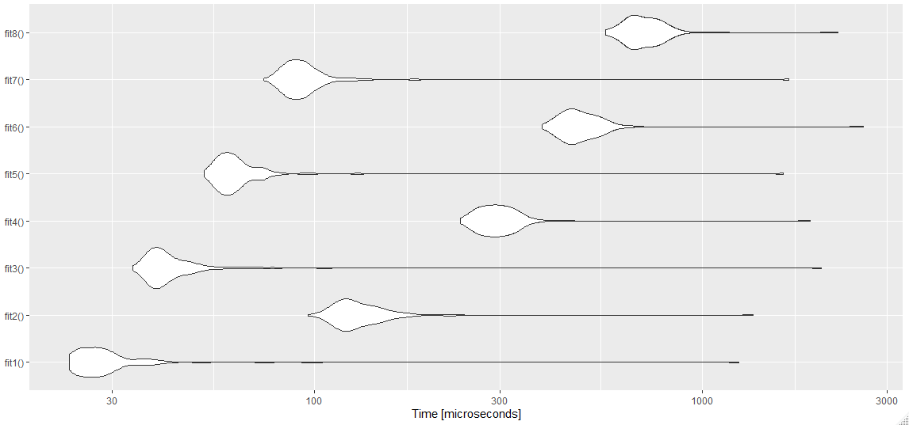
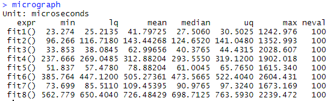
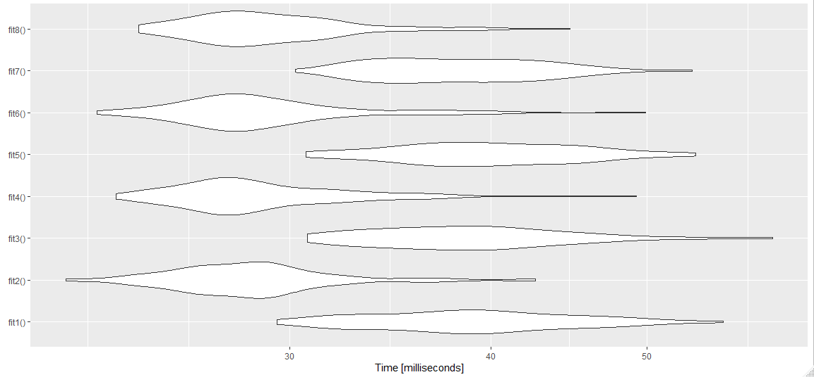
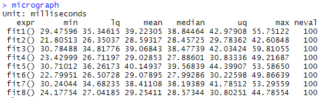
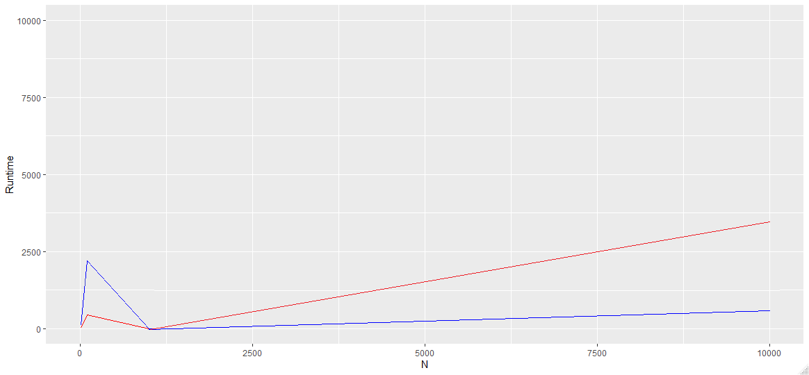
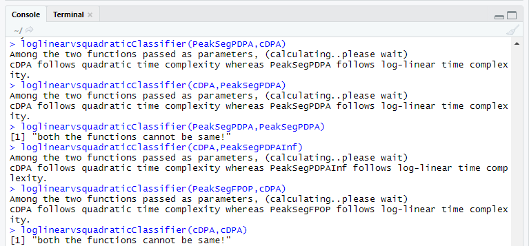
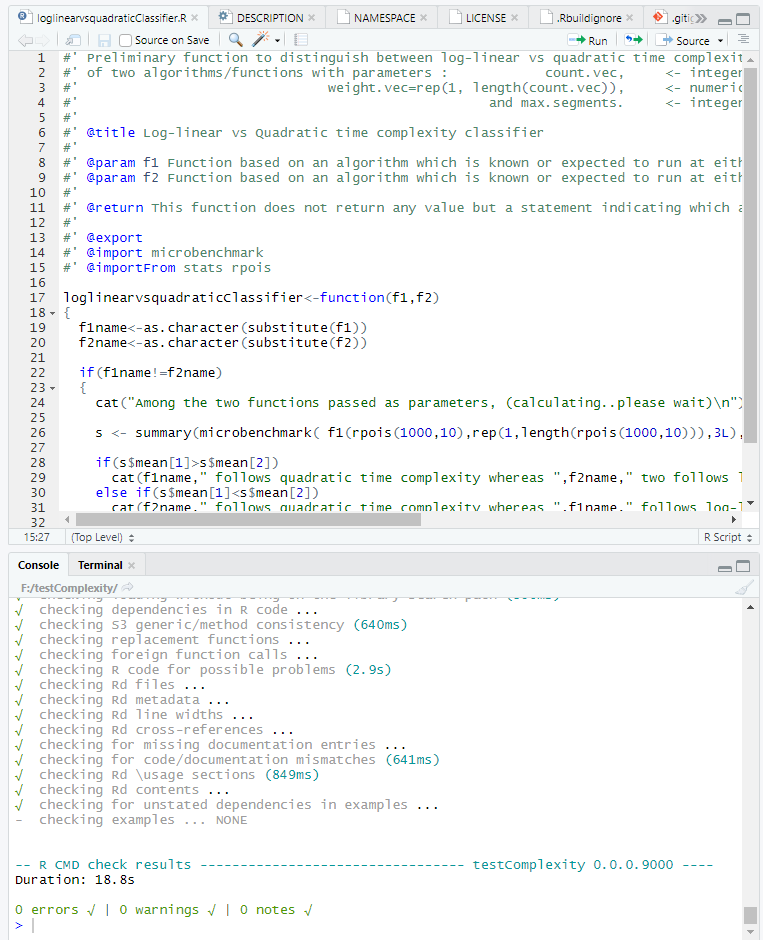
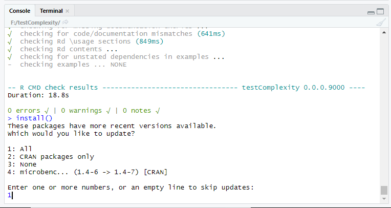
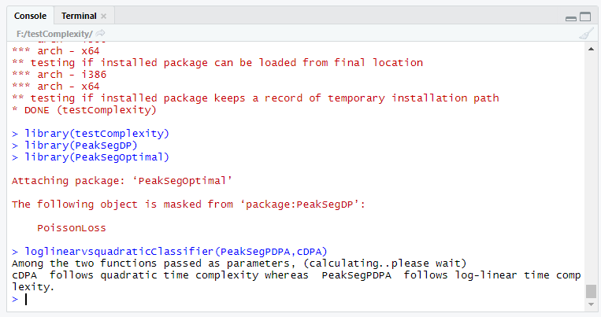
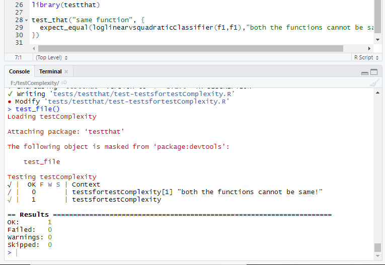

Easy Test
---
Package dependencies: PeakSegDP, PeakSegOptimal, tidyverse (ggplot2) and microbenchmark. <br>
Input: N=10 (lambda/mean for rpois values set to N(L) as well) <br>

(1) Using autoplot: <br>
Case I: Using small dataset sizes: (N,N+10,N+20,N+30)
```
library(PeakSegDP)
library(PeakSegOptimal)
library(ggplot2)
library(microbenchmark)

N <- readline(prompt="Enter size: ")
N <- as.integer(N)

# fits(i) where i is odd pertain to cDPA (quadratic) and where i is even pertain to PDPA (log-linear):
fit1 <- function() cDPA(rpois(N,N), maxSegments=3)
fit2 <- function() PeakSegPDPA(rpois(N,N), max.segments=3L)
fit3 <- function() cDPA(rpois(N+10,N), maxSegments=3)
fit4 <- function() PeakSegPDPA(rpois(N+10,N), max.segments=3L)
fit5 <- function() cDPA(rpois(N+20,N), maxSegments=3)
fit6 <- function() PeakSegPDPA(rpois(N+20,N), max.segments=3L)
fit7 <- function() cDPA(rpois(N+30,N), maxSegments=3)
fit8 <- function() PeakSegPDPA(rpois(N+30,N), max.segments=3L)

# The difference in time is observed at each alternate fit (cDPA<PeakSegPDPA for this case):
micrograph <- microbenchmark(fit1(),fit2(),fit3(),fit4(),fit5(),fit6(),fit7(),fit8())
autoplot(micrograph,title="PeakSegDP::cDPA (quadratic) vs PeakSegOptimal::PeakSegPDPA (log-linear)")
```
Output plot:

Microbenchmark computed values: <br>

 <br>

We can infer from the above data that PeakSegPDPA is consuming more time than cDPA (reverse of actual complexity) for small values in the dataset. <br>

Case II: Using large dataset sizes: (N,N+90,N+990,N+9990)
```
library(PeakSegDP)
library(PeakSegOptimal)
library(microbenchmark)
library(ggplot2)

N <- readline(prompt="Enter size: ")
N <- as.integer(N)

fit1 <- function() cDPA(rpois(N,N), maxSegments=3)
fit2 <- function() PeakSegPDPA(rpois(N,N), max.segments=3L)
fit3 <- function() cDPA(rpois(N+90,N), maxSegments=3)
fit4 <- function() PeakSegPDPA(rpois(N+90,N), max.segments=3L)
fit5 <- function() cDPA(rpois(N+990,N), maxSegments=3)
fit6 <- function() PeakSegPDPA(rpois(N+990,N), max.segments=3L)
fit7 <- function() cDPA(rpois(N+9990,N), maxSegments=3)
fit8 <- function() PeakSegPDPA(rpois(N+9990,N), max.segments=3L)

# The difference in time is observed at each alternate fit (cDPA>PeakSegPDPA for this case):
micrograph <- microbenchmark(fit1(),fit2(),fit3(),fit4(),fit5(),fit6(),fit7(),fit8())
autoplot(micrograph,title="PeakSegDP::cDPA (quadratic) vs PeakSegOptimal::PeakSegPDPA (log-linear)")
```

Microbenchmark computed values: <br>

 <br>

From the data above we can infer that cDPA is consuming more time than PeakSegPDPA (which is expected) for large values in the dataset. <br>
The observations made above won't be noticeable if we used autoplot and directly jumped into a dataset with possibly more of large values, wherein only the expected trend in time complexity will be shown (and not the initial reverse trend) in the violin plots. <br>

(2) Using ggplot:
```
library(PeakSegDP)
library(PeakSegOptimal)
library(ggplot2)
library(microbenchmark)

N <- readline(prompt="Enter size: ")
N <- as.integer(N)

# Specifying dataset values in a vector and assigning its length as size to PeakSegPDPA and cDPA (arrays):
Nvalues=c(N,N+90,N+990,N+9990)
peaksegpdpa<-integer(length(Nvalues))
cdpa<-integer(length(Nvalues))

# Iterating through 'Nvalues' and computing microbenchmark values:
for (loopvariable in 1:length(Nvalues))
{ x <- rpois(Nvalues[loopvariable], N)
  s <- summary(microbenchmark( PeakSegPDPA(x, rep(1, length(x)), 3L),cDPA(x, rep(1, length(x)), 3L)))
  
  # Extract the mean from the microbenchmarked values to an array of PeakSegPDPA and cDPA values respectively:
  peaksegpdpa[loopvariable] <- s$mean[1]  
  cdpa[loopvariable] <- s$mean[2]
}
ggplot(data.frame(peaksegpdpa, cdpa, Nvalues), aes(x=Nvalues, y=cdpa)) + geom_line(color = 'red') + geom_line(y = peaksegpdpa, color='blue') + labs(x="N", y="Runtime") + scale_y_continuous(lim=c(0,10000))
# The difference in time is seen by the growth rate in plot (cDPA>PDPA), which at start however has a higher rate for PDPA:
```
Output plot:

It is clear from the plot above that initially for small values of dataset sizes : PDPA>cDPA. After that for larger dataset sizes it follows the estimated trend of cDPA>PDPA in terms of runtime complexity. 
Hence we can safely conclude that computation times of PeakSegDP::cDPA follow a greater time complexity (quadratic) as compared to PeakSegOptimal::PeakSegPDPA (log-linear) taking into consideration the trend for large dataset sizes N following the plot(s) obtained. 

Medium Test
---
Function Name: loglinearvsquadraticClassifier <br>
Function Body/Definition:
```
loglinearvsquadraticClassifier<-function(f1,f2)
{
  f1name<-as.character(substitute(f1))
  f2name<-as.character(substitute(f2))

  if(f1name!=f2name)
  {
    cat("Among the two functions passed as parameters, (calculating..please wait)\n")

    s <- summary(microbenchmark( f1(rpois(1000,10),rep(1,length(rpois(1000,10))),3L),f2(rpois(1000,10),rep(1,length(rpois(1000,10))),3L)))

    if(s$mean[1]>s$mean[2])
         cat(f1name,"follows quadratic time complexity whereas",f2name,"follows log-linear time complexity.")
    else if(s$mean[1]<s$mean[2])
         cat(f2name,"follows quadratic time complexity whereas",f1name,"follows log-linear time complexity.")
  }
  else print("both the functions cannot be same!")
}
```
Examples: <br>
 <br>
This is just a preliminary function to comply with the test, classifying asymptotic time complexity of two functions (considering one of them follows a log-linear trend while the remaining follows a quadratic one) based on microbenchmark timings. <br>
From the easy test I could figure out that from around N=1000 observations the trend is quadratic for the tested PeakSegDP::cDPA (and similar functions) and further tests by increasing the range would be unnecessary. (I started with a for loop ranging from N values 1e+01 to 1e+06 with two counters each for f1 and f2, with them incrementing by one if s$mean[1]>s$mean[2] and reverse for the later respectively, with f1/f2 being quadratic in nature if their respective count value is higher than the other - but that was unecessary since a single point i.e. at N=1000 itself there was a clear distinction of the quadratic trend remaining the same for higher N values, so thereafter I considered to use that point only) <br>

However to classify on a broader range with all complexities taken into account (linear, log, cubic, exponential etc) we will require to loop through increasing sizes of data, and benchmark them accordingly - maybe through sampling of a model.

Hard Test
---
Package name: testComplexity <br>
Function(s): loglinearvsquadraticClassifier(function1,function2) <br>
Documentation: (roxygen format) <br>
```
#' Preliminary function to distinguish between log-linear vs quadratic time complexity
#' of two algorithms/functions with parameters :            count.vec,     <- integer vector of count data.
#'                               weight.vec=rep(1, length(count.vec)),     <- numeric vector (same length as count.vec) of positive weights.
#'                                                   and max.segments.     <- integer of length 1: maximum number of segments (must be >= 2, default value: 3).
#'
#' @title Log-linear vs Quadratic time complexity classifier
#'
#' @param f1 Function based on an algorithm which is known or expected to run at either log-linear or quadratic time complexity, different from that of f2.
#' @param f2 Function based on an algorithm which is known or expected to run at either log-linear or quadratic time complexity, different from that of f1.
#'
#' @return This function does not return any value but a statement indicating which among the two is log-linear and which is quadratic in nature.
#'
#' @export
#' @import microbenchmark
#' @importFrom stats rpois
```
R CMD check() results: <br>
 <br>

Installation: <br>
Might be prompted for updates: <br>
 <br>
Successful installation and an example run: <br>
 <br>

Install locally using : 
```install.packages("testComplexity")``` <br>
Install via Github using (repository not linked yet) : <br>
```if(!require(devtools))install.packages("devtools") devtools::install_github("Anirban166/RGSOC_20_Tests")``` <br>

Tests: (using testthat) <br>
 <br>

Thanks for reading! - Anirban
