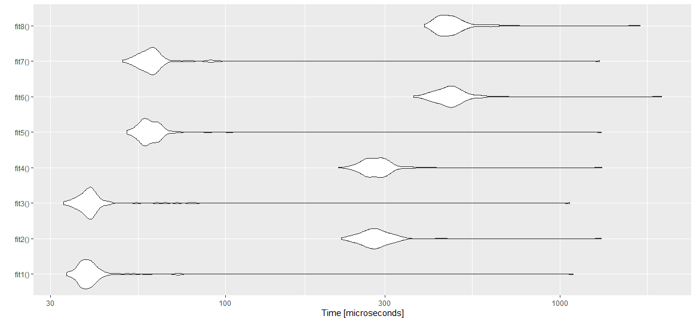

#Easy Test
Using autoplot: (Initial try)
```
library(PeakSegDP)
library(PeakSegOptimal)
library(ggplot2)
library(microbenchmark)

N <- readline(prompt="Enter size: ")
N <- as.integer(N)

# fits(i) where i is odd pertain to cDPA (quadratic) and where i is even pertain to PDPA (log-linear).
fit1 <- function() cDPA(rpois(N, 30), maxSegments=3)
fit2 <- function() PeakSegPDPA(rpois(N, 30), max.segments=3L)
fit3 <- function() cDPA(rpois(N, 20), maxSegments=3)
fit4 <- function() PeakSegPDPA(rpois(N, 20), max.segments=3L)
fit5 <- function() cDPA(rpois(N+10, 20), maxSegments=3)
fit6 <- function() PeakSegPDPA(rpois(N+10, 20), max.segments=3L)
fit7 <- function() cDPA(rpois(N+10, 30), maxSegments=3)
fit8 <- function() PeakSegPDPA(rpois(N+10, 30), max.segments=3L)

micrograph <- microbenchmark(fit1(),fit2(),fit3(),fit4(),fit5(),fit6(),fit7(),fit8())
autoplot(micrograph,title="PeakSegDP::cDPA (quadratic) vs PeakSegOptimal::PeakSegPDPA (log-linear)")
```
The difference in time is observed at each alternate fit (cDPA>PDPA): (N=10)


Using ggplot:
```
library(PeakSegDP)
library(PeakSegOptimal)
library(ggplot2)
library(microbenchmark)

N <- readline(prompt="Enter size: ")
N <- as.integer(N)

nval=c(N,N+90,N+990,N+9990)
cdpa<-integer(length(nval))
pdpa<-integer(length(nval))
for (i in seq(1, length(nval)))
{ x <- rpois(nval[i], 10)
  s <- summary(microbenchmark( PeakSegPDPA(x, rep(1, length(x)), 3),cDPA(x, rep(1, length(x)), 3)))
  pdpa[i] <- s$mean[1]  
  cdpa[i] <- s$mean[2]
}
ggplot(data.frame(pdpa, cdpa, nval), aes(x=nval, y=cdpa)) + geom_line(color = 'red') 
+ geom_line(y = pdpa, color='blue') + labs(x="N", y="Runtime") + scale_y_continuous(lim=c(0,10000))
```
The difference in time is seen by the growth rate in plot (cDPA>PDPA), which at start however has a higher rate for PDPA: (N=10)

