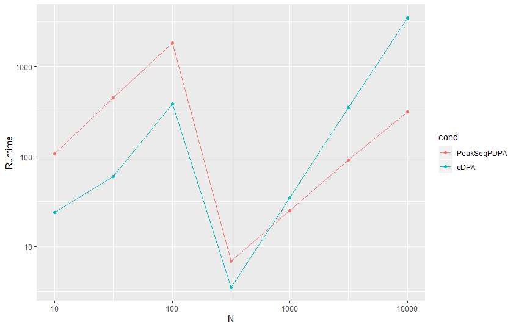

Easy Test
---
Package dependencies: PeakSegDP, PeakSegOptimal, tidyverse (ggplot2), dplyr (data.table) and microbenchmark. <br>

### Third Revision:
```
library(PeakSegDP)
library(PeakSegOptimal)
library(ggplot2)
library(microbenchmark)
require(dplyr)
library(data.table)

datasetsizes<-c(10^seq(1,4,by=0.5))
l <- length(datasetsizes)

for(i in 1:l)
{
     s <- as.data.frame(microbenchmark(
    "PeakSegPDPA" = PeakSegPDPA(rpois(datasetsizes[i],10),max.segments=3L),
    "cDPA" = cDPA(rpois(datasetsizes[i],10),maxSegments=3)))

     if(i==1) # for the first iteration we append datasetsize as the third column to s and initialize combinator as s: 
     {  
        s$datasetsize<-datasetsizes[i]
        combinator<-s
     }
     # we must add/append datasetsize to other data frames as well: (in order to plot datasetsize vs time from resulting data frame)
     s$datasetsize<-datasetsizes[i] # add datasetsize
      
     if(i!=1) # bind/combine all data frames after first iteration to combinator (final data frame) - gets +200x2 obs per iteration.
     {  combinator<-rbind(combinator,s) }
}

#dt <- data.table(combinator)

# Plot as per suggestion (3):
# data frame (combinator) , mapping = datasetsize vs time , geometry = point (+line) based on algorithm (PeakSegPDPA/cDPA)
ggplot(combinator, aes(x=datasetsize,y=time)) + geom_point(aes(color = expr)) + geom_line(aes(color = expr)) + labs(x="N", y="Runtime") + scale_x_log10() + scale_y_log10()
```
Here's my idea: We know that the data frame returned by microbenchmark is a 200x2 one (with expr and time being the 2 variables), and since its already a data frame from which we need all the columns (unlike the previous case, when I needed to exclude neval), there isn't a need to change that and instead I should just append the dataset size to them for plotting purposes. <br>
Now the looping part - for one iteration we would only get one data frame (stored in s) and for multiple iterations we will need an array of data frames i.e. a list using which when I tried the code became a bit messy and I eventually dropped the idea trying to think of a simpler solution. <br>
I found that it would be easier to just append each data frame collected in s to consecutive iterations - something which rbind() can do. After this point it was relatively simple - I took a dataframe by the name of 'combinator' and for the first iteration I simply had the data in s collected to it (i.e. the first 200 obs. from dataset size 10) for the purpose of initializing combinator size. (since I didn't explicitly declare it outside) <br>
Then I append the dataset size column to that as combinator would be a 200x3 dataframe (expr,time,datasetsizes). This condition of adding the datasetsize column is there for every iteration since s is 200x2 as returned by microbenchmark. <br>
After the first iteration I use rbind to join the corresponding 200x3 data frames for different data set sizes together.
Hence the final result would be a (200x7)x3 or 1400x3 data frame. (7 dataset sizes) <br>
Lastly I did the plotting with dataset vs microbenchmark timings, distinguished by expr which I set to PeakSegPDPA and cDPA inside the microbenchmark catering to respective algorithm calls (just like last revision). 

Output Plot: <br>
 <br>

Data from microbenchmark: <br>
Initially when I ran ```> combinator``` it showed uptil obs. 333 with ```[ reached 'max' / getOption("max.print") -- omitted 267 rows ]``` at the end. <br>
Going by the statement I checked ```getOption("max.print")``` which returned 1000, so I figured if I get 333 obs.for 1000, 5000 should be a safe number to print 1400 obs. and so I set my max print accordingly: ```options(max.print=5000)```
And here is the complete data from microbenchmark with dataset size appended to it: (Super long!)
```
> combinator
           expr     time datasetsize
1   PeakSegPDPA   191120    10.00000
2          cDPA    38437    10.00000
3   PeakSegPDPA   115659    10.00000
4          cDPA    27505    10.00000
5   PeakSegPDPA   123064    10.00000
6   PeakSegPDPA   119537    10.00000
7          cDPA    26800    10.00000
8   PeakSegPDPA   116717    10.00000
9   PeakSegPDPA   139990    10.00000
10  PeakSegPDPA   130469    10.00000
11         cDPA    28563    10.00000
12         cDPA    23625    10.00000
13         cDPA    23626    10.00000
14         cDPA    24331    10.00000
15         cDPA    23273    10.00000
16  PeakSegPDPA   112485    10.00000
17  PeakSegPDPA   112133    10.00000
18         cDPA    26094    10.00000
19  PeakSegPDPA   122711    10.00000
20  PeakSegPDPA   117774    10.00000
21  PeakSegPDPA   114954    10.00000
22         cDPA    25742    10.00000
23  PeakSegPDPA   132584    10.00000
24         cDPA    25037    10.00000
25  PeakSegPDPA   118833    10.00000
26  PeakSegPDPA   117069    10.00000
27  PeakSegPDPA   118833    10.00000
28  PeakSegPDPA   105433    10.00000
29         cDPA    25742    10.00000
30  PeakSegPDPA   113190    10.00000
31  PeakSegPDPA   118127    10.00000
32  PeakSegPDPA   108960    10.00000
33         cDPA    25741    10.00000
34         cDPA    24332    10.00000
35  PeakSegPDPA    93444    10.00000
36         cDPA    25037    10.00000
37         cDPA    23979    10.00000
38         cDPA    23626    10.00000
39         cDPA    25036    10.00000
40         cDPA    23979    10.00000
41  PeakSegPDPA   112838    10.00000
42  PeakSegPDPA   102260    10.00000
43  PeakSegPDPA   138931    10.00000
44  PeakSegPDPA   113191    10.00000
45  PeakSegPDPA   122359    10.00000
46         cDPA    26095    10.00000
47         cDPA    23625    10.00000
48         cDPA    24331    10.00000
49  PeakSegPDPA   104375    10.00000
50         cDPA    23626    10.00000
51         cDPA    23626    10.00000
52         cDPA    23274    10.00000
53         cDPA    22568    10.00000
54  PeakSegPDPA   108254    10.00000
55  PeakSegPDPA   106843    10.00000
56         cDPA    23626    10.00000
57         cDPA    22567    10.00000
58         cDPA    23274    10.00000
59         cDPA    22569    10.00000
60  PeakSegPDPA   122006    10.00000
61         cDPA    24684    10.00000
62  PeakSegPDPA    99086    10.00000
63         cDPA    24685    10.00000
64         cDPA    23978    10.00000
65  PeakSegPDPA   104375    10.00000
66         cDPA    23626    10.00000
67         cDPA    23626    10.00000
68         cDPA    22567    10.00000
69         cDPA    22568    10.00000
70         cDPA    24684    10.00000
71         cDPA    21863    10.00000
72         cDPA    23626    10.00000
73  PeakSegPDPA   138579    10.00000
74         cDPA    24684    10.00000
75  PeakSegPDPA   116364    10.00000
76  PeakSegPDPA   110017    10.00000
77  PeakSegPDPA   101201    10.00000
78         cDPA    25389    10.00000
79         cDPA    24331    10.00000
80         cDPA    23273    10.00000
81         cDPA    22921    10.00000
82         cDPA    21863    10.00000
83  PeakSegPDPA   117775    10.00000
84  PeakSegPDPA   130116    10.00000
85  PeakSegPDPA   143868    10.00000
86  PeakSegPDPA    95913    10.00000
87         cDPA    26799    10.00000
88  PeakSegPDPA   104023    10.00000
89         cDPA    26094    10.00000
90         cDPA    26094    10.00000
91         cDPA    24331    10.00000
92  PeakSegPDPA   117070    10.00000
93         cDPA    25036    10.00000
94  PeakSegPDPA   131526    10.00000
95         cDPA    24684    10.00000
96  PeakSegPDPA   126590    10.00000
97  PeakSegPDPA   106491    10.00000
98         cDPA    24683    10.00000
99         cDPA    25389    10.00000
100 PeakSegPDPA    89213    10.00000
101 PeakSegPDPA   105786    10.00000
102        cDPA    24685    10.00000
103        cDPA    25036    10.00000
104        cDPA    22920    10.00000
105 PeakSegPDPA   119890    10.00000
106 PeakSegPDPA   129058    10.00000
107 PeakSegPDPA   125532    10.00000
108 PeakSegPDPA   114954    10.00000
109 PeakSegPDPA   102964    10.00000
110 PeakSegPDPA   114601    10.00000
111        cDPA    25742    10.00000
112 PeakSegPDPA   125532    10.00000
113        cDPA    26447    10.00000
114        cDPA    24683    10.00000
115        cDPA    22568    10.00000
116 PeakSegPDPA   124827    10.00000
117        cDPA    23979    10.00000
118 PeakSegPDPA   110722    10.00000
119        cDPA    26094    10.00000
120 PeakSegPDPA   128001    10.00000
121        cDPA    25389    10.00000
122        cDPA    23626    10.00000
123 PeakSegPDPA   109665    10.00000
124        cDPA    23979    10.00000
125        cDPA    22568    10.00000
126 PeakSegPDPA   113191    10.00000
127        cDPA    25389    10.00000
128 PeakSegPDPA   107901    10.00000
129        cDPA    23978    10.00000
130        cDPA    23273    10.00000
131        cDPA    24331    10.00000
132 PeakSegPDPA   131174    10.00000
133        cDPA    25389    10.00000
134        cDPA    23626    10.00000
135 PeakSegPDPA   117422    10.00000
136 PeakSegPDPA   104729    10.00000
137        cDPA    25036    10.00000
138        cDPA    23626    10.00000
139        cDPA    22921    10.00000
140 PeakSegPDPA   135405    10.00000
141 PeakSegPDPA   107196    10.00000
142        cDPA    25741    10.00000
143 PeakSegPDPA   130469    10.00000
144 PeakSegPDPA   110018    10.00000
145        cDPA    26095    10.00000
146 PeakSegPDPA   102259    10.00000
147 PeakSegPDPA   108606    10.00000
148        cDPA    25037    10.00000
149        cDPA    23626    10.00000
150 PeakSegPDPA   115306    10.00000
151        cDPA    24331    10.00000
152        cDPA    22922    10.00000
153 PeakSegPDPA    83924    10.00000
154 PeakSegPDPA   113544    10.00000
155        cDPA    26799    10.00000
156 PeakSegPDPA   100496    10.00000
157 PeakSegPDPA   118480    10.00000
158 PeakSegPDPA   101907    10.00000
159        cDPA    25741    10.00000
160 PeakSegPDPA   107902    10.00000
161        cDPA    24684    10.00000
162 PeakSegPDPA   110722    10.00000
163 PeakSegPDPA   102259    10.00000
164        cDPA    24331    10.00000
165        cDPA    22922    10.00000
166 PeakSegPDPA   123416    10.00000
167 PeakSegPDPA   108960    10.00000
168 PeakSegPDPA   109311    10.00000
169        cDPA    25036    10.00000
170 PeakSegPDPA   125532    10.00000
171        cDPA    24684    10.00000
172 PeakSegPDPA   107196    10.00000
173        cDPA    24684    10.00000
174        cDPA    24685    10.00000
175        cDPA    22567    10.00000
176 PeakSegPDPA   108254    10.00000
177 PeakSegPDPA   106843    10.00000
178 PeakSegPDPA   112485    10.00000
179 PeakSegPDPA   116012    10.00000
180 PeakSegPDPA   111076    10.00000
181 PeakSegPDPA   129411    10.00000
182        cDPA    26095    10.00000
183 PeakSegPDPA   133289    10.00000
184 PeakSegPDPA   121654    10.00000
185 PeakSegPDPA    98734    10.00000
186 PeakSegPDPA   107549    10.00000
187        cDPA    26093    10.00000
188        cDPA    24332    10.00000
189 PeakSegPDPA   115306    10.00000
190        cDPA    25389    10.00000
191        cDPA    24332    10.00000
192 PeakSegPDPA   123416    10.00000
193 PeakSegPDPA    89566    10.00000
194        cDPA    25036    10.00000
195 PeakSegPDPA   116011    10.00000
196 PeakSegPDPA   114954    10.00000
197        cDPA    26093    10.00000
198        cDPA    23626    10.00000
199 PeakSegPDPA   118480    10.00000
200 PeakSegPDPA   116364    10.00000
201 PeakSegPDPA   497544    31.62278
202 PeakSegPDPA   490845    31.62278
203 PeakSegPDPA   568421    31.62278
204        cDPA    70172    31.62278
205        cDPA    61357    31.62278
206 PeakSegPDPA   454525    31.62278
207        cDPA    65589    31.62278
208 PeakSegPDPA   496486    31.62278
209 PeakSegPDPA   483791    31.62278
210 PeakSegPDPA   454525    31.62278
211        cDPA    66646    31.62278
212        cDPA    53952    31.62278
213 PeakSegPDPA   486260    31.62278
214 PeakSegPDPA   485556    31.62278
215        cDPA    62063    31.62278
216        cDPA    62062    31.62278
217        cDPA    57478    31.62278
218 PeakSegPDPA   552200    31.62278
219        cDPA    62415    31.62278
220        cDPA    66294    31.62278
221        cDPA    52894    31.62278
222 PeakSegPDPA   521874    31.62278
223 PeakSegPDPA   542680    31.62278
224 PeakSegPDPA   482030    31.62278
225        cDPA    65588    31.62278
226 PeakSegPDPA   415384    31.62278
227 PeakSegPDPA   447473    31.62278
228 PeakSegPDPA   562073    31.62278
229 PeakSegPDPA   495781    31.62278
230 PeakSegPDPA   502129    31.62278
231 PeakSegPDPA   413622    31.62278
232        cDPA    66646    31.62278
233 PeakSegPDPA   449940    31.62278
234 PeakSegPDPA   439716    31.62278
235 PeakSegPDPA   459461    31.62278
236 PeakSegPDPA   533511    31.62278
237        cDPA    63473    31.62278
238 PeakSegPDPA   465456    31.62278
239        cDPA    62415    31.62278
240 PeakSegPDPA   459462    31.62278
241 PeakSegPDPA   471450    31.62278
242        cDPA    67704    31.62278
243 PeakSegPDPA   460520    31.62278
244        cDPA    64530    31.62278
245 PeakSegPDPA   498249    31.62278
246 PeakSegPDPA   440773    31.62278
247        cDPA    67350    31.62278
248        cDPA    54305    31.62278
249 PeakSegPDPA   442888    31.62278
250        cDPA    57478    31.62278
251 PeakSegPDPA   509181    31.62278
252        cDPA    59594    31.62278
253 PeakSegPDPA   582878    31.62278
254 PeakSegPDPA   593808    31.62278
255        cDPA    86745    31.62278
256        cDPA    68409    31.62278
257        cDPA    60652    31.62278
258        cDPA    76167    31.62278
259 PeakSegPDPA   611440    31.62278
260 PeakSegPDPA   550436    31.62278
261 PeakSegPDPA   492255    31.62278
262 PeakSegPDPA   491549    31.62278
263        cDPA    71583    31.62278
264        cDPA    63120    31.62278
265        cDPA    54305    31.62278
266 PeakSegPDPA   526459    31.62278
267 PeakSegPDPA   438305    31.62278
268        cDPA    68409    31.62278
269        cDPA    58183    31.62278
270        cDPA    56421    31.62278
271        cDPA    60300    31.62278
272 PeakSegPDPA   466867    31.62278
273 PeakSegPDPA   448531    31.62278
274        cDPA    63473    31.62278
275        cDPA    56420    31.62278
276 PeakSegPDPA   464046    31.62278
277 PeakSegPDPA   566305    31.62278
278 PeakSegPDPA   399869    31.62278
279        cDPA    65236    31.62278
280        cDPA    66294    31.62278
281 PeakSegPDPA   588872    31.62278
282 PeakSegPDPA   561016    31.62278
283        cDPA    65941    31.62278
284        cDPA    66646    31.62278
285        cDPA    56420    31.62278
286 PeakSegPDPA   495076    31.62278
287 PeakSegPDPA   459109    31.62278
288        cDPA    56420    31.62278
289        cDPA    64178    31.62278
290        cDPA    57125    31.62278
291        cDPA    55362    31.62278
292        cDPA    55715    31.62278
293 PeakSegPDPA   482382    31.62278
294        cDPA    70877    31.62278
295 PeakSegPDPA   525048    31.62278
296        cDPA    59946    31.62278
297        cDPA    68409    31.62278
298        cDPA    58183    31.62278
299        cDPA    65236    31.62278
300 PeakSegPDPA   534216    31.62278
301        cDPA    71583    31.62278
302 PeakSegPDPA   418205    31.62278
303        cDPA    69467    31.62278
304 PeakSegPDPA   452762    31.62278
305 PeakSegPDPA   543385    31.62278
306        cDPA    73699    31.62278
307        cDPA    64178    31.62278
308        cDPA    58888    31.62278
309 PeakSegPDPA   606856    31.62278
310 PeakSegPDPA   490492    31.62278
311        cDPA    64179    31.62278
312 PeakSegPDPA   540564    31.62278
313        cDPA    68762    31.62278
314 PeakSegPDPA   436542    31.62278
315        cDPA    64178    31.62278
316 PeakSegPDPA   493313    31.62278
317        cDPA    64531    31.62278
318        cDPA    59594    31.62278
319        cDPA    63120    31.62278
320        cDPA    58889    31.62278
321 PeakSegPDPA   449588    31.62278
322        cDPA    78635    31.62278
323        cDPA    57831    31.62278
324        cDPA    52189    31.62278
325        cDPA    61357    31.62278
326        cDPA    51484    31.62278
327        cDPA    54305    31.62278
328        cDPA    53952    31.62278
329 PeakSegPDPA   495076    31.62278
330        cDPA    65941    31.62278
331 PeakSegPDPA   424905    31.62278
332        cDPA    61710    31.62278
333        cDPA    62415    31.62278
334 PeakSegPDPA   424905    31.62278
335        cDPA    61356    31.62278
336 PeakSegPDPA   514823    31.62278
337        cDPA    61005    31.62278
338        cDPA    60299    31.62278
339 PeakSegPDPA   477092    31.62278
340        cDPA    62062    31.62278
341 PeakSegPDPA   466514    31.62278
342        cDPA    61710    31.62278
343        cDPA   111428    31.62278
344 PeakSegPDPA   476387    31.62278
345 PeakSegPDPA   482734    31.62278
346 PeakSegPDPA   559605    31.62278
347        cDPA    91329    31.62278
348 PeakSegPDPA   503891    31.62278
349        cDPA    72640    31.62278
350 PeakSegPDPA   432310    31.62278
351        cDPA    70878    31.62278
352        cDPA    67351    31.62278
353 PeakSegPDPA   581467    31.62278
354 PeakSegPDPA   497897    31.62278
355        cDPA    65941    31.62278
356        cDPA    58889    31.62278
357 PeakSegPDPA   419616    31.62278
358 PeakSegPDPA   482382    31.62278
359        cDPA    68410    31.62278
360 PeakSegPDPA   449589    31.62278
361 PeakSegPDPA   455230    31.62278
362        cDPA    63120    31.62278
363 PeakSegPDPA   446415    31.62278
364 PeakSegPDPA   492255    31.62278
365        cDPA    64883    31.62278
366        cDPA    56067    31.62278
367        cDPA    63826    31.62278
368        cDPA    65941    31.62278
369 PeakSegPDPA   541269    31.62278
370 PeakSegPDPA   471452    31.62278
371        cDPA    75462    31.62278
372 PeakSegPDPA   472508    31.62278
373        cDPA    66999    31.62278
374        cDPA    61005    31.62278
375 PeakSegPDPA   513764    31.62278
376 PeakSegPDPA   628012    31.62278
377        cDPA    73699    31.62278
378        cDPA    63472    31.62278
379 PeakSegPDPA   391759    31.62278
380        cDPA    57125    31.62278
381 PeakSegPDPA   532453    31.62278
382 PeakSegPDPA   462988    31.62278
383 PeakSegPDPA   558547    31.62278
384 PeakSegPDPA   458051    31.62278
385 PeakSegPDPA   469335    31.62278
386 PeakSegPDPA   443593    31.62278
387        cDPA    68762    31.62278
388        cDPA    61709    31.62278
389        cDPA    61709    31.62278
390        cDPA    54658    31.62278
391 PeakSegPDPA   531042    31.62278
392        cDPA    63120    31.62278
393 PeakSegPDPA   500718    31.62278
394 PeakSegPDPA   494723    31.62278
395 PeakSegPDPA   587814    31.62278
396 PeakSegPDPA   472862    31.62278
397 PeakSegPDPA   453467    31.62278
398 PeakSegPDPA   507065    31.62278
399 PeakSegPDPA   460520    31.62278
400 PeakSegPDPA   455231    31.62278
401  PeakSegPDPA    2111824   100.00000
402         cDPA     439714   100.00000
403  PeakSegPDPA    1847010   100.00000
404  PeakSegPDPA    1651659   100.00000
405         cDPA     360376   100.00000
406  PeakSegPDPA    1845599   100.00000
407         cDPA     369191   100.00000
408         cDPA     344156   100.00000
409  PeakSegPDPA    1716189   100.00000
410         cDPA     388938   100.00000
411         cDPA     363197   100.00000
412  PeakSegPDPA    1914007   100.00000
413  PeakSegPDPA    2082558   100.00000
414         cDPA     420322   100.00000
415  PeakSegPDPA    2135450   100.00000
416         cDPA     378712   100.00000
417  PeakSegPDPA    2249346   100.00000
418  PeakSegPDPA    1857940   100.00000
419  PeakSegPDPA    1775076   100.00000
420         cDPA     464751   100.00000
421  PeakSegPDPA    1961257   100.00000
422  PeakSegPDPA    1862878   100.00000
423         cDPA     435131   100.00000
424         cDPA     349092   100.00000
425  PeakSegPDPA    2112883   100.00000
426  PeakSegPDPA    2135450   100.00000
427         cDPA     431604   100.00000
428  PeakSegPDPA    1914007   100.00000
429  PeakSegPDPA    1873456   100.00000
430         cDPA     413269   100.00000
431         cDPA     360728   100.00000
432  PeakSegPDPA    1645312   100.00000
433         cDPA     383649   100.00000
434  PeakSegPDPA    2101599   100.00000
435  PeakSegPDPA    1920706   100.00000
436  PeakSegPDPA    1967604   100.00000
437  PeakSegPDPA    2050822   100.00000
438         cDPA     352266   100.00000
439  PeakSegPDPA    1957731   100.00000
440  PeakSegPDPA    1596651   100.00000
441  PeakSegPDPA    2042359   100.00000
442         cDPA     392112   100.00000
443         cDPA     394580   100.00000
444  PeakSegPDPA    1719714   100.00000
445         cDPA     396695   100.00000
446  PeakSegPDPA    1938690   100.00000
447         cDPA     442183   100.00000
448  PeakSegPDPA    1988057   100.00000
449  PeakSegPDPA    1995109   100.00000
450         cDPA     415031   100.00000
451         cDPA     398812   100.00000
452  PeakSegPDPA    1863936   100.00000
453         cDPA     398812   100.00000
454  PeakSegPDPA    1756739   100.00000
455         cDPA     467572   100.00000
456  PeakSegPDPA    1972894   100.00000
457         cDPA     365313   100.00000
458  PeakSegPDPA    1924938   100.00000
459         cDPA     398812   100.00000
460  PeakSegPDPA    2214436   100.00000
461  PeakSegPDPA    1754976   100.00000
462  PeakSegPDPA    1942921   100.00000
463         cDPA     398812   100.00000
464         cDPA     349445   100.00000
465         cDPA     339219   100.00000
466         cDPA     343804   100.00000
467  PeakSegPDPA    1854414   100.00000
468         cDPA     375538   100.00000
469         cDPA     363197   100.00000
470         cDPA     461578   100.00000
471  PeakSegPDPA    1940806   100.00000
472         cDPA     407980   100.00000
473         cDPA     419263   100.00000
474         cDPA     431957   100.00000
475         cDPA     374833   100.00000
476  PeakSegPDPA    1581842   100.00000
477         cDPA     427726   100.00000
478  PeakSegPDPA    2078679   100.00000
479         cDPA     416089   100.00000
480         cDPA     368487   100.00000
481         cDPA     372366   100.00000
482         cDPA     354029   100.00000
483  PeakSegPDPA    1768729   100.00000
484  PeakSegPDPA    1812453   100.00000
485         cDPA     374129   100.00000
486  PeakSegPDPA    1817743   100.00000
487  PeakSegPDPA    2009566   100.00000
488  PeakSegPDPA    1939396   100.00000
489         cDPA     357556   100.00000
490  PeakSegPDPA    1776486   100.00000
491         cDPA     428078   100.00000
492  PeakSegPDPA    1775781   100.00000
493  PeakSegPDPA    1985235   100.00000
494  PeakSegPDPA    1544111   100.00000
495         cDPA     386117   100.00000
496  PeakSegPDPA    1862524   100.00000
497         cDPA     432663   100.00000
498  PeakSegPDPA    2058932   100.00000
499         cDPA     411505   100.00000
500         cDPA     428431   100.00000
501         cDPA     346977   100.00000
502  PeakSegPDPA    1767317   100.00000
503         cDPA     403043   100.00000
504         cDPA     399869   100.00000
505         cDPA     425257   100.00000
506         cDPA     412916   100.00000
507         cDPA     348740   100.00000
508  PeakSegPDPA    1775075   100.00000
509         cDPA     452409   100.00000
510  PeakSegPDPA    1879450   100.00000
511         cDPA     430194   100.00000
512  PeakSegPDPA    1948916   100.00000
513  PeakSegPDPA    2006392   100.00000
514         cDPA     383649   100.00000
515         cDPA     433367   100.00000
516         cDPA     451704   100.00000
517         cDPA     411858   100.00000
518  PeakSegPDPA    2053290   100.00000
519  PeakSegPDPA    1772960   100.00000
520         cDPA     406921   100.00000
521         cDPA     423495   100.00000
522  PeakSegPDPA    1736641   100.00000
523  PeakSegPDPA    1706667   100.00000
524         cDPA     478503   100.00000
525  PeakSegPDPA    1726767   100.00000
526         cDPA     409743   100.00000
527  PeakSegPDPA    1750039   100.00000
528         cDPA     392112   100.00000
529  PeakSegPDPA    2084322   100.00000
530  PeakSegPDPA    1983472   100.00000
531  PeakSegPDPA    1780718   100.00000
532  PeakSegPDPA    1910481   100.00000
533  PeakSegPDPA    1995814   100.00000
534  PeakSegPDPA    1725709   100.00000
535         cDPA     371661   100.00000
536  PeakSegPDPA    1907660   100.00000
537  PeakSegPDPA    2012035   100.00000
538         cDPA     445710   100.00000
539  PeakSegPDPA    1980652   100.00000
540         cDPA     439715   100.00000
541  PeakSegPDPA    1885444   100.00000
542  PeakSegPDPA    1967957   100.00000
543  PeakSegPDPA    1880155   100.00000
544         cDPA     379417   100.00000
545         cDPA     422437   100.00000
546  PeakSegPDPA    2018381   100.00000
547  PeakSegPDPA    1798348   100.00000
548         cDPA     423847   100.00000
549         cDPA     482028   100.00000
550  PeakSegPDPA    2174944   100.00000
551  PeakSegPDPA    1902370   100.00000
552         cDPA     446062   100.00000
553         cDPA     477799   100.00000
554  PeakSegPDPA    2045886   100.00000
555         cDPA     350503   100.00000
556         cDPA     393170   100.00000
557  PeakSegPDPA    2020849   100.00000
558  PeakSegPDPA    1964431   100.00000
559         cDPA     447120   100.00000
560  PeakSegPDPA    1784244   100.00000
561  PeakSegPDPA    2025082   100.00000
562         cDPA     437246   100.00000
563  PeakSegPDPA    1895319   100.00000
564         cDPA     409742   100.00000
565         cDPA     395285   100.00000
566  PeakSegPDPA    2238414   100.00000
567  PeakSegPDPA    2081501   100.00000
568         cDPA     401985   100.00000
569  PeakSegPDPA    2162602   100.00000
570  PeakSegPDPA    2028255   100.00000
571         cDPA     404101   100.00000
572         cDPA     411859   100.00000
573         cDPA     392112   100.00000
574  PeakSegPDPA    2013092   100.00000
575  PeakSegPDPA    2011681   100.00000
576         cDPA     388234   100.00000
577         cDPA     350150   100.00000
578         cDPA     423847   100.00000
579  PeakSegPDPA    1843131   100.00000
580  PeakSegPDPA    2078326   100.00000
581         cDPA     437247   100.00000
582         cDPA     418910   100.00000
583  PeakSegPDPA    1766260   100.00000
584         cDPA     430899   100.00000
585  PeakSegPDPA    1869577   100.00000
586  PeakSegPDPA    1859352   100.00000
587         cDPA     466514   100.00000
588         cDPA     396344   100.00000
589  PeakSegPDPA    1842073   100.00000
590         cDPA     447120   100.00000
591         cDPA     443947   100.00000
592  PeakSegPDPA    1885796   100.00000
593         cDPA     362845   100.00000
594         cDPA     417852   100.00000
595         cDPA     442889   100.00000
596         cDPA     416442   100.00000
597         cDPA     381533   100.00000
598  PeakSegPDPA    1975009   100.00000
599  PeakSegPDPA    2448574   100.00000
600  PeakSegPDPA    2061752   100.00000
601         cDPA    4320619   316.22777
602         cDPA    4457785   316.22777
603  PeakSegPDPA    8518876   316.22777
604         cDPA    4954270   316.22777
605         cDPA    4336486   316.22777
606         cDPA    3402402   316.22777
607         cDPA    3525820   316.22777
608  PeakSegPDPA   10691350   316.22777
609  PeakSegPDPA    9798876   316.22777
610  PeakSegPDPA    7929301   316.22777
611  PeakSegPDPA    9218468   316.22777
612  PeakSegPDPA    9275945   316.22777
613  PeakSegPDPA    9098931   316.22777
614         cDPA    4955329   316.22777
615         cDPA    4120332   316.22777
616         cDPA    4788188   316.22777
617  PeakSegPDPA    9210358   316.22777
618  PeakSegPDPA    9171923   316.22777
619  PeakSegPDPA    8285797   316.22777
620         cDPA    3721522   316.22777
621         cDPA    4169345   316.22777
622  PeakSegPDPA    9475174   316.22777
623  PeakSegPDPA    8709642   316.22777
624         cDPA    3826954   316.22777
625  PeakSegPDPA    8140519   316.22777
626         cDPA    3892893   316.22777
627  PeakSegPDPA    7614414   316.22777
628         cDPA    3678855   316.22777
629         cDPA    3731748   316.22777
630         cDPA    4485643   316.22777
631         cDPA    3516298   316.22777
632  PeakSegPDPA    7171527   316.22777
633         cDPA    3398877   316.22777
634  PeakSegPDPA    7337962   316.22777
635         cDPA    4128442   316.22777
636  PeakSegPDPA    9035460   316.22777
637  PeakSegPDPA    7221598   316.22777
638         cDPA    4445797   316.22777
639  PeakSegPDPA    8817895   316.22777
640  PeakSegPDPA    7226887   316.22777
641         cDPA    4496927   316.22777
642  PeakSegPDPA    6287517   316.22777
643  PeakSegPDPA    7024133   316.22777
644         cDPA    3419329   316.22777
645  PeakSegPDPA    7331967   316.22777
646         cDPA    4070612   316.22777
647  PeakSegPDPA    6495559   316.22777
648  PeakSegPDPA    8525576   316.22777
649         cDPA    4275483   316.22777
650  PeakSegPDPA    6441609   316.22777
651  PeakSegPDPA    7622524   316.22777
652  PeakSegPDPA    6719824   316.22777
653         cDPA    4658425   316.22777
654         cDPA    4361169   316.22777
655  PeakSegPDPA    7024484   316.22777
656         cDPA    3722933   316.22777
657         cDPA    3513830   316.22777
658  PeakSegPDPA    6702193   316.22777
659  PeakSegPDPA    7761456   316.22777
660         cDPA    4272310   316.22777
661         cDPA    3575186   316.22777
662         cDPA    3119957   316.22777
663  PeakSegPDPA    7166237   316.22777
664  PeakSegPDPA    6929984   316.22777
665  PeakSegPDPA    7139438   316.22777
666         cDPA    4132321   316.22777
667         cDPA    3549091   316.22777
668  PeakSegPDPA    7429995   316.22777
669         cDPA    3497258   316.22777
670         cDPA    3338580   316.22777
671  PeakSegPDPA    7560463   316.22777
672  PeakSegPDPA    6259307   316.22777
673  PeakSegPDPA    7595724   316.22777
674         cDPA    3470811   316.22777
675         cDPA    3652762   316.22777
676         cDPA    4081544   316.22777
677  PeakSegPDPA    8353851   316.22777
678  PeakSegPDPA    7422942   316.22777
679         cDPA    3746205   316.22777
680         cDPA    4040993   316.22777
681  PeakSegPDPA    7405664   316.22777
682  PeakSegPDPA    7605246   316.22777
683  PeakSegPDPA    8540386   316.22777
684         cDPA    3851285   316.22777
685  PeakSegPDPA    6959604   316.22777
686  PeakSegPDPA    7468783   316.22777
687  PeakSegPDPA    7012496   316.22777
688  PeakSegPDPA    7390149   316.22777
689         cDPA    4481764   316.22777
690  PeakSegPDPA    6972298   316.22777
691         cDPA    3792398   316.22777
692         cDPA    3719758   316.22777
693         cDPA    4054745   316.22777
694         cDPA    3869621   316.22777
695  PeakSegPDPA    7401786   316.22777
696  PeakSegPDPA    6859814   316.22777
697         cDPA    3566018   316.22777
698  PeakSegPDPA    7484651   316.22777
699  PeakSegPDPA    7166943   316.22777
700         cDPA    3551207   316.22777
701         cDPA    3173555   316.22777
702         cDPA    3936971   316.22777
703  PeakSegPDPA    6881676   316.22777
704  PeakSegPDPA    7252628   316.22777
705         cDPA    3456354   316.22777
706  PeakSegPDPA    6838304   316.22777
707         cDPA    3964475   316.22777
708  PeakSegPDPA    7691990   316.22777
709         cDPA    3868915   316.22777
710         cDPA    3633720   316.22777
711         cDPA   11966765   316.22777
712         cDPA    3976463   316.22777
713         cDPA    4473653   316.22777
714  PeakSegPDPA    6756144   316.22777
715         cDPA    4413003   316.22777
716  PeakSegPDPA    7738888   316.22777
717  PeakSegPDPA    8898997   316.22777
718  PeakSegPDPA    7027659   316.22777
719         cDPA    3892540   316.22777
720         cDPA    4393610   316.22777
721         cDPA    4402072   316.22777
722         cDPA    3453180   316.22777
723  PeakSegPDPA    6516010   316.22777
724         cDPA    3237026   316.22777
725         cDPA    3983868   316.22777
726  PeakSegPDPA    8008286   316.22777
727         cDPA    4384442   316.22777
728         cDPA    3172145   316.22777
729  PeakSegPDPA    7379218   316.22777
730  PeakSegPDPA    8701531   316.22777
731  PeakSegPDPA    6572429   316.22777
732         cDPA    3330822   316.22777
733         cDPA    3648530   316.22777
734         cDPA    4078017   316.22777
735         cDPA    3631957   316.22777
736  PeakSegPDPA    7106998   316.22777
737         cDPA    3543802   316.22777
738         cDPA    3847759   316.22777
739  PeakSegPDPA    6845708   316.22777
740         cDPA    4558282   316.22777
741  PeakSegPDPA    7626755   316.22777
742  PeakSegPDPA    6949377   316.22777
743  PeakSegPDPA    7232529   316.22777
744  PeakSegPDPA    7188805   316.22777
745         cDPA    3374899   316.22777
746         cDPA    3277577   316.22777
747  PeakSegPDPA    7317510   316.22777
748         cDPA    3601280   316.22777
749         cDPA    3514183   316.22777
750  PeakSegPDPA    7774855   316.22777
751         cDPA    4018778   316.22777
752  PeakSegPDPA    7776265   316.22777
753  PeakSegPDPA    7298117   316.22777
754  PeakSegPDPA    7372166   316.22777
755         cDPA    3070238   316.22777
756  PeakSegPDPA    7448330   316.22777
757  PeakSegPDPA    6301620   316.22777
758  PeakSegPDPA    8546380   316.22777
759         cDPA    4277952   316.22777
760         cDPA    3962359   316.22777
761  PeakSegPDPA    7245224   316.22777
762  PeakSegPDPA    7312926   316.22777
763  PeakSegPDPA    6482513   316.22777
764  PeakSegPDPA    6681742   316.22777
765         cDPA    4186623   316.22777
766  PeakSegPDPA    6873566   316.22777
767  PeakSegPDPA    7617587   316.22777
768         cDPA    3331879   316.22777
769         cDPA    4160882   316.22777
770  PeakSegPDPA    6693730   316.22777
771  PeakSegPDPA    6661290   316.22777
772  PeakSegPDPA    6946557   316.22777
773         cDPA    3272287   316.22777
774         cDPA    3148871   316.22777
775  PeakSegPDPA    6721234   316.22777
776         cDPA    4063913   316.22777
777  PeakSegPDPA    6937388   316.22777
778         cDPA    3582238   316.22777
779         cDPA    3287803   316.22777
780  PeakSegPDPA    7596429   316.22777
781  PeakSegPDPA    7703273   316.22777
782         cDPA    3506425   316.22777
783         cDPA    3128419   316.22777
784         cDPA    3489500   316.22777
785  PeakSegPDPA    8248066   316.22777
786  PeakSegPDPA    7818227   316.22777
787         cDPA    3424970   316.22777
788  PeakSegPDPA    7097477   316.22777
789  PeakSegPDPA    7037885   316.22777
790  PeakSegPDPA    7251571   316.22777
791         cDPA    4136905   316.22777
792         cDPA    4235989   316.22777
793  PeakSegPDPA    6999097   316.22777
794         cDPA    3492320   316.22777
795         cDPA    3953896   316.22777
796         cDPA    3971879   316.22777
797         cDPA    3224684   316.22777
798         cDPA    3252893   316.22777
799  PeakSegPDPA    6724760   316.22777
800  PeakSegPDPA    7487824   316.22777
801  PeakSegPDPA   26126807  1000.00000
802         cDPA   32570529  1000.00000
803  PeakSegPDPA   29681537  1000.00000
804  PeakSegPDPA   27640238  1000.00000
805         cDPA   46160389  1000.00000
806  PeakSegPDPA   29678717  1000.00000
807  PeakSegPDPA   27586640  1000.00000
808  PeakSegPDPA   24835170  1000.00000
809         cDPA   43080632  1000.00000
810         cDPA   34023664  1000.00000
811         cDPA   42024191  1000.00000
812         cDPA   39358407  1000.00000
813  PeakSegPDPA   26407136  1000.00000
814  PeakSegPDPA   28990409  1000.00000
815  PeakSegPDPA   28357814  1000.00000
816  PeakSegPDPA   29329274  1000.00000
817         cDPA   32487664  1000.00000
818         cDPA   35783928  1000.00000
819         cDPA   43443475  1000.00000
820  PeakSegPDPA   25767136  1000.00000
821  PeakSegPDPA   26445219  1000.00000
822         cDPA   35052249  1000.00000
823         cDPA   31825802  1000.00000
824  PeakSegPDPA   25633495  1000.00000
825  PeakSegPDPA   21466619  1000.00000
826  PeakSegPDPA   24850684  1000.00000
827         cDPA   30310607  1000.00000
828  PeakSegPDPA   27278806  1000.00000
829         cDPA   35177427  1000.00000
830  PeakSegPDPA   27316536  1000.00000
831         cDPA   34011322  1000.00000
832  PeakSegPDPA   25439907  1000.00000
833         cDPA   38578065  1000.00000
834         cDPA   32502121  1000.00000
835         cDPA   32844513  1000.00000
836         cDPA   44491806  1000.00000
837  PeakSegPDPA   27326761  1000.00000
838  PeakSegPDPA   24120063  1000.00000
839  PeakSegPDPA   24162376  1000.00000
840  PeakSegPDPA   28940337  1000.00000
841         cDPA   30567311  1000.00000
842         cDPA   42909260  1000.00000
843  PeakSegPDPA   26987192  1000.00000
844  PeakSegPDPA   25437440  1000.00000
845  PeakSegPDPA   22266003  1000.00000
846  PeakSegPDPA   38867564  1000.00000
847         cDPA   39793537  1000.00000
848  PeakSegPDPA   30635014  1000.00000
849         cDPA   43447353  1000.00000
850  PeakSegPDPA   24871137  1000.00000
851         cDPA   36923939  1000.00000
852  PeakSegPDPA   28546111  1000.00000
853         cDPA   32643874  1000.00000
854  PeakSegPDPA   25480812  1000.00000
855  PeakSegPDPA   25701902  1000.00000
856  PeakSegPDPA   26318982  1000.00000
857         cDPA   33478518  1000.00000
858  PeakSegPDPA   26597903  1000.00000
859         cDPA   31363168  1000.00000
860  PeakSegPDPA   23838321  1000.00000
861         cDPA   43970285  1000.00000
862         cDPA   32882948  1000.00000
863  PeakSegPDPA   26760106  1000.00000
864         cDPA   44899430  1000.00000
865         cDPA   39909195  1000.00000
866         cDPA   42539365  1000.00000
867  PeakSegPDPA   27366607  1000.00000
868  PeakSegPDPA   27443830  1000.00000
869  PeakSegPDPA   25156052  1000.00000
870  PeakSegPDPA   28904371  1000.00000
871  PeakSegPDPA   28789065  1000.00000
872         cDPA   34290595  1000.00000
873         cDPA   32151620  1000.00000
874         cDPA   40716335  1000.00000
875         cDPA   43756247  1000.00000
876         cDPA   40846097  1000.00000
877         cDPA   38444423  1000.00000
878         cDPA   32741901  1000.00000
879  PeakSegPDPA   27319357  1000.00000
880  PeakSegPDPA   24528040  1000.00000
881         cDPA   33178794  1000.00000
882         cDPA   36044865  1000.00000
883  PeakSegPDPA   26024900  1000.00000
884  PeakSegPDPA   29225604  1000.00000
885  PeakSegPDPA   25578840  1000.00000
886         cDPA   41466352  1000.00000
887  PeakSegPDPA   30204469  1000.00000
888  PeakSegPDPA   26956162  1000.00000
889  PeakSegPDPA   34516270  1000.00000
890         cDPA   36733173  1000.00000
891  PeakSegPDPA   32681252  1000.00000
892  PeakSegPDPA   25686035  1000.00000
893         cDPA   46476687  1000.00000
894         cDPA   34053988  1000.00000
895  PeakSegPDPA   27113429  1000.00000
896         cDPA   37143971  1000.00000
897  PeakSegPDPA   24896525  1000.00000
898  PeakSegPDPA   27649053  1000.00000
899         cDPA   41095398  1000.00000
900         cDPA   35127356  1000.00000
901         cDPA   38368611  1000.00000
902         cDPA   31443213  1000.00000
903         cDPA   42412775  1000.00000
904         cDPA   37499058  1000.00000
905  PeakSegPDPA   27582409  1000.00000
906  PeakSegPDPA   27791863  1000.00000
907  PeakSegPDPA   27186068  1000.00000
908  PeakSegPDPA   24745958  1000.00000
909         cDPA   39925768  1000.00000
910         cDPA   39583377  1000.00000
911  PeakSegPDPA   23991357  1000.00000
912         cDPA   34187984  1000.00000
913         cDPA   31377626  1000.00000
914         cDPA   31583555  1000.00000
915  PeakSegPDPA   23719842  1000.00000
916  PeakSegPDPA   25683214  1000.00000
917  PeakSegPDPA   23522377  1000.00000
918  PeakSegPDPA   24023093  1000.00000
919  PeakSegPDPA   27071467  1000.00000
920  PeakSegPDPA   22383776  1000.00000
921  PeakSegPDPA   25180029  1000.00000
922         cDPA   35308953  1000.00000
923         cDPA   32403036  1000.00000
924  PeakSegPDPA   21935953  1000.00000
925  PeakSegPDPA   26177230  1000.00000
926  PeakSegPDPA   29296127  1000.00000
927  PeakSegPDPA   26561583  1000.00000
928         cDPA   38207818  1000.00000
929         cDPA   40606671  1000.00000
930  PeakSegPDPA   25645483  1000.00000
931  PeakSegPDPA   25092227  1000.00000
932         cDPA   40957525  1000.00000
933         cDPA   48277502  1000.00000
934         cDPA   46514770  1000.00000
935  PeakSegPDPA   27250949  1000.00000
936         cDPA   39150010  1000.00000
937         cDPA   35890067  1000.00000
938  PeakSegPDPA   25115148  1000.00000
939  PeakSegPDPA   26015731  1000.00000
940         cDPA   36728942  1000.00000
941  PeakSegPDPA   26229417  1000.00000
942         cDPA   44797525  1000.00000
943         cDPA   41613745  1000.00000
944  PeakSegPDPA   25873980  1000.00000
945  PeakSegPDPA   25360570  1000.00000
946         cDPA   37539255  1000.00000
947         cDPA   35190122  1000.00000
948         cDPA   35319884  1000.00000
949  PeakSegPDPA   27057714  1000.00000
950  PeakSegPDPA   23729010  1000.00000
951  PeakSegPDPA   25866928  1000.00000
952  PeakSegPDPA   26352481  1000.00000
953         cDPA   35400986  1000.00000
954  PeakSegPDPA   25409583  1000.00000
955         cDPA   35784986  1000.00000
956  PeakSegPDPA   25173330  1000.00000
957         cDPA   31669592  1000.00000
958         cDPA   32086386  1000.00000
959  PeakSegPDPA   32843455  1000.00000
960         cDPA   31415356  1000.00000
961         cDPA   38069945  1000.00000
962         cDPA   35521934  1000.00000
963         cDPA   30811323  1000.00000
964         cDPA   40729382  1000.00000
965         cDPA   31973196  1000.00000
966  PeakSegPDPA   27099676  1000.00000
967         cDPA   37044181  1000.00000
968         cDPA   30721759  1000.00000
969         cDPA   46038031  1000.00000
970  PeakSegPDPA   34669306  1000.00000
971         cDPA   36653482  1000.00000
972  PeakSegPDPA   30395235  1000.00000
973         cDPA   40901106  1000.00000
974         cDPA   41332357  1000.00000
975  PeakSegPDPA   24995610  1000.00000
976         cDPA   38366848  1000.00000
977         cDPA   32905868  1000.00000
978         cDPA   35664743  1000.00000
979         cDPA   42312984  1000.00000
980  PeakSegPDPA   23514618  1000.00000
981         cDPA   36070254  1000.00000
982  PeakSegPDPA   25139478  1000.00000
983  PeakSegPDPA   25309087  1000.00000
984         cDPA   33248259  1000.00000
985         cDPA   38442660  1000.00000
986         cDPA   40164843  1000.00000
987  PeakSegPDPA   25148294  1000.00000
988  PeakSegPDPA   28490045  1000.00000
989  PeakSegPDPA   27235082  1000.00000
990  PeakSegPDPA   25008305  1000.00000
991  PeakSegPDPA   26144437  1000.00000
992  PeakSegPDPA   24195522  1000.00000
993  PeakSegPDPA   30990099  1000.00000
994         cDPA   37105184  1000.00000
995  PeakSegPDPA   29768281  1000.00000
996         cDPA   35584699  1000.00000
997         cDPA   35173900  1000.00000
998         cDPA   31879752  1000.00000
999         cDPA   35380887  1000.00000
1000 PeakSegPDPA   25626090  1000.00000
1001 PeakSegPDPA   97936910  3162.27766
1002        cDPA  356875575  3162.27766
1003 PeakSegPDPA  102404921  3162.27766
1004        cDPA  345930696  3162.27766
1005 PeakSegPDPA   84882323  3162.27766
1006 PeakSegPDPA  101333670  3162.27766
1007        cDPA  412736810  3162.27766
1008 PeakSegPDPA   94502068  3162.27766
1009 PeakSegPDPA   92795754  3162.27766
1010        cDPA  342719412  3162.27766
1011 PeakSegPDPA   86296317  3162.27766
1012        cDPA  446838755  3162.27766
1013        cDPA  399679402  3162.27766
1014        cDPA  356102639  3162.27766
1015 PeakSegPDPA   77788020  3162.27766
1016 PeakSegPDPA   88111942  3162.27766
1017 PeakSegPDPA   93568338  3162.27766
1018        cDPA  364252675  3162.27766
1019        cDPA  431593006  3162.27766
1020        cDPA  347673682  3162.27766
1021 PeakSegPDPA  105833063  3162.27766
1022 PeakSegPDPA  102475444  3162.27766
1023        cDPA  326995162  3162.27766
1024 PeakSegPDPA  108186781  3162.27766
1025 PeakSegPDPA   94621958  3162.27766
1026        cDPA  389975735  3162.27766
1027 PeakSegPDPA   94363136  3162.27766
1028 PeakSegPDPA   97508127  3162.27766
1029 PeakSegPDPA   85922543  3162.27766
1030 PeakSegPDPA   86412328  3162.27766
1031        cDPA  431796465  3162.27766
1032        cDPA  385032044  3162.27766
1033        cDPA  364445557  3162.27766
1034 PeakSegPDPA   95249969  3162.27766
1035        cDPA  422311068  3162.27766
1036        cDPA  367770736  3162.27766
1037        cDPA  359196148  3162.27766
1038        cDPA  354172765  3162.27766
1039        cDPA  388014127  3162.27766
1040 PeakSegPDPA   89387006  3162.27766
1041 PeakSegPDPA   91758002  3162.27766
1042        cDPA  442740640  3162.27766
1043        cDPA  407536768  3162.27766
1044        cDPA  315025929  3162.27766
1045 PeakSegPDPA   85378103  3162.27766
1046 PeakSegPDPA   97425263  3162.27766
1047        cDPA  305454846  3162.27766
1048 PeakSegPDPA   91495302  3162.27766
1049 PeakSegPDPA   87811159  3162.27766
1050        cDPA  313859825  3162.27766
1051 PeakSegPDPA   82701739  3162.27766
1052        cDPA  406996558  3162.27766
1053        cDPA  365939948  3162.27766
1054 PeakSegPDPA   93585969  3162.27766
1055 PeakSegPDPA   98929174  3162.27766
1056        cDPA  381598260  3162.27766
1057 PeakSegPDPA   85834037  3162.27766
1058 PeakSegPDPA   84979645  3162.27766
1059 PeakSegPDPA   94751721  3162.27766
1060        cDPA  346345726  3162.27766
1061 PeakSegPDPA   83587866  3162.27766
1062 PeakSegPDPA   99191873  3162.27766
1063        cDPA  405910498  3162.27766
1064 PeakSegPDPA   90519258  3162.27766
1065        cDPA  333078863  3162.27766
1066        cDPA  328300550  3162.27766
1067 PeakSegPDPA   91494597  3162.27766
1068 PeakSegPDPA   96078618  3162.27766
1069 PeakSegPDPA   94703764  3162.27766
1070        cDPA  435897754  3162.27766
1071 PeakSegPDPA   90123974  3162.27766
1072        cDPA  360556898  3162.27766
1073 PeakSegPDPA   97088160  3162.27766
1074 PeakSegPDPA   88912382  3162.27766
1075        cDPA  436794459  3162.27766
1076 PeakSegPDPA   97973583  3162.27766
1077        cDPA  397829925  3162.27766
1078        cDPA  315646888  3162.27766
1079        cDPA  361646130  3162.27766
1080        cDPA  442501566  3162.27766
1081        cDPA  420997569  3162.27766
1082 PeakSegPDPA   87767788  3162.27766
1083 PeakSegPDPA  104846087  3162.27766
1084        cDPA  333083447  3162.27766
1085 PeakSegPDPA  103044215  3162.27766
1086        cDPA  333943480  3162.27766
1087 PeakSegPDPA  103568909  3162.27766
1088        cDPA  426216301  3162.27766
1089        cDPA  306980267  3162.27766
1090        cDPA  347775941  3162.27766
1091 PeakSegPDPA   90078487  3162.27766
1092        cDPA  368248885  3162.27766
1093 PeakSegPDPA   94099027  3162.27766
1094 PeakSegPDPA   99002872  3162.27766
1095 PeakSegPDPA  103528711  3162.27766
1096 PeakSegPDPA   83430598  3162.27766
1097 PeakSegPDPA  102716281  3162.27766
1098 PeakSegPDPA  104379575  3162.27766
1099 PeakSegPDPA   89750906  3162.27766
1100 PeakSegPDPA   90860592  3162.27766
1101        cDPA  311133743  3162.27766
1102        cDPA  352290849  3162.27766
1103        cDPA  366871209  3162.27766
1104 PeakSegPDPA  102599212  3162.27766
1105 PeakSegPDPA   87273772  3162.27766
1106        cDPA  342592823  3162.27766
1107        cDPA  309819893  3162.27766
1108 PeakSegPDPA   91728735  3162.27766
1109 PeakSegPDPA   91560184  3162.27766
1110 PeakSegPDPA   84584008  3162.27766
1111 PeakSegPDPA   94616668  3162.27766
1112        cDPA  310153468  3162.27766
1113 PeakSegPDPA  103068193  3162.27766
1114 PeakSegPDPA   96300061  3162.27766
1115 PeakSegPDPA   83638643  3162.27766
1116 PeakSegPDPA   92914233  3162.27766
1117 PeakSegPDPA   95924172  3162.27766
1118        cDPA  388372738  3162.27766
1119 PeakSegPDPA   98187974  3162.27766
1120        cDPA  444223394  3162.27766
1121        cDPA  414653284  3162.27766
1122 PeakSegPDPA  103202893  3162.27766
1123 PeakSegPDPA   85898918  3162.27766
1124        cDPA  342450719  3162.27766
1125 PeakSegPDPA   89988218  3162.27766
1126        cDPA  318009069  3162.27766
1127        cDPA  300725899  3162.27766
1128 PeakSegPDPA  125727363  3162.27766
1129        cDPA  347031566  3162.27766
1130        cDPA  345567500  3162.27766
1131 PeakSegPDPA   97251775  3162.27766
1132 PeakSegPDPA  105424733  3162.27766
1133        cDPA  390414037  3162.27766
1134 PeakSegPDPA   95005605  3162.27766
1135        cDPA  312292795  3162.27766
1136        cDPA  378465609  3162.27766
1137        cDPA  418351884  3162.27766
1138        cDPA  378326679  3162.27766
1139 PeakSegPDPA   87724064  3162.27766
1140        cDPA  421942936  3162.27766
1141        cDPA  379597863  3162.27766
1142        cDPA  405216547  3162.27766
1143 PeakSegPDPA   93585969  3162.27766
1144        cDPA  368582813  3162.27766
1145        cDPA  353450253  3162.27766
1146        cDPA  330262511  3162.27766
1147        cDPA  331108086  3162.27766
1148 PeakSegPDPA   85213077  3162.27766
1149        cDPA  374892542  3162.27766
1150        cDPA  364329194  3162.27766
1151 PeakSegPDPA   91949120  3162.27766
1152 PeakSegPDPA   85285717  3162.27766
1153        cDPA  399613111  3162.27766
1154 PeakSegPDPA   86510356  3162.27766
1155        cDPA  345224051  3162.27766
1156        cDPA  379750898  3162.27766
1157        cDPA  359556522  3162.27766
1158 PeakSegPDPA   90632095  3162.27766
1159 PeakSegPDPA   87242389  3162.27766
1160        cDPA  327787139  3162.27766
1161        cDPA  350289747  3162.27766
1162 PeakSegPDPA   90803468  3162.27766
1163        cDPA  346687059  3162.27766
1164 PeakSegPDPA   87895435  3162.27766
1165        cDPA  406694012  3162.27766
1166        cDPA  381347901  3162.27766
1167        cDPA  305688278  3162.27766
1168        cDPA  335069033  3162.27766
1169        cDPA  378062568  3162.27766
1170        cDPA  315302733  3162.27766
1171        cDPA  399555986  3162.27766
1172 PeakSegPDPA   94856448  3162.27766
1173 PeakSegPDPA   97577240  3162.27766
1174        cDPA  352517934  3162.27766
1175 PeakSegPDPA   96480249  3162.27766
1176        cDPA  384489366  3162.27766
1177 PeakSegPDPA   92572547  3162.27766
1178        cDPA  380091174  3162.27766
1179 PeakSegPDPA   78936494  3162.27766
1180 PeakSegPDPA   88228305  3162.27766
1181 PeakSegPDPA   86412328  3162.27766
1182 PeakSegPDPA   87808339  3162.27766
1183 PeakSegPDPA   96273967  3162.27766
1184        cDPA  331675447  3162.27766
1185 PeakSegPDPA   94351501  3162.27766
1186        cDPA  457258587  3162.27766
1187        cDPA  388520837  3162.27766
1188 PeakSegPDPA  104038243  3162.27766
1189        cDPA  336811314  3162.27766
1190 PeakSegPDPA   89658520  3162.27766
1191 PeakSegPDPA   94032029  3162.27766
1192 PeakSegPDPA   86526224  3162.27766
1193        cDPA  348608470  3162.27766
1194 PeakSegPDPA   89401816  3162.27766
1195        cDPA  303725965  3162.27766
1196        cDPA  429972731  3162.27766
1197 PeakSegPDPA   93653671  3162.27766
1198 PeakSegPDPA   85397144  3162.27766
1199        cDPA  344030442  3162.27766
1200        cDPA  464920603  3162.27766
1201 PeakSegPDPA  285903995 10000.00000
1202        cDPA 3092790817 10000.00000
1203 PeakSegPDPA  340789539 10000.00000
1204        cDPA 3547161470 10000.00000
1205        cDPA 4057759374 10000.00000
1206 PeakSegPDPA  332698037 10000.00000
1207        cDPA 3951132220 10000.00000
1208        cDPA 3218484326 10000.00000
1209        cDPA 3368468917 10000.00000
1210 PeakSegPDPA  307705953 10000.00000
1211 PeakSegPDPA  319841620 10000.00000
1212 PeakSegPDPA  334567965 10000.00000
1213 PeakSegPDPA  349170541 10000.00000
1214 PeakSegPDPA  327593553 10000.00000
1215        cDPA 3057998096 10000.00000
1216 PeakSegPDPA  297844665 10000.00000
1217 PeakSegPDPA  311387980 10000.00000
1218 PeakSegPDPA  300482241 10000.00000
1219        cDPA 3225415014 10000.00000
1220        cDPA 3171311222 10000.00000
1221 PeakSegPDPA  321355758 10000.00000
1222        cDPA 4128344133 10000.00000
1223 PeakSegPDPA  307800101 10000.00000
1224        cDPA 3783761495 10000.00000
1225        cDPA 4031943578 10000.00000
1226        cDPA 3291478165 10000.00000
1227        cDPA 3047302165 10000.00000
1228 PeakSegPDPA  313852773 10000.00000
1229 PeakSegPDPA  327898214 10000.00000
1230 PeakSegPDPA  351326441 10000.00000
1231        cDPA 3870222835 10000.00000
1232 PeakSegPDPA  381237532 10000.00000
1233        cDPA 4199929267 10000.00000
1234        cDPA 4461664891 10000.00000
1235        cDPA 3368673082 10000.00000
1236        cDPA 3633267372 10000.00000
1237        cDPA 3015338489 10000.00000
1238        cDPA 3233493823 10000.00000
1239 PeakSegPDPA  325853740 10000.00000
1240        cDPA 3747632707 10000.00000
1241        cDPA 3738241105 10000.00000
1242 PeakSegPDPA  342611159 10000.00000
1243 PeakSegPDPA  299229745 10000.00000
1244 PeakSegPDPA  319890986 10000.00000
1245 PeakSegPDPA  298294252 10000.00000
1246        cDPA 3071500859 10000.00000
1247 PeakSegPDPA  281149660 10000.00000
1248        cDPA 3114354053 10000.00000
1249        cDPA 3445602480 10000.00000
1250 PeakSegPDPA  311159484 10000.00000
1251        cDPA 3253253775 10000.00000
1252        cDPA 3144671712 10000.00000
1253        cDPA 4140879668 10000.00000
1254        cDPA 4092687148 10000.00000
1255 PeakSegPDPA  310679221 10000.00000
1256        cDPA 3145442886 10000.00000
1257        cDPA 2983463674 10000.00000
1258        cDPA 3813808696 10000.00000
1259        cDPA 3944502667 10000.00000
1260        cDPA 3738863827 10000.00000
1261 PeakSegPDPA  326343877 10000.00000
1262 PeakSegPDPA  307836068 10000.00000
1263 PeakSegPDPA  323139294 10000.00000
1264        cDPA 3285412094 10000.00000
1265        cDPA 3521180647 10000.00000
1266        cDPA 4548480611 10000.00000
1267 PeakSegPDPA  319316221 10000.00000
1268        cDPA 3453014136 10000.00000
1269 PeakSegPDPA  336728801 10000.00000
1270 PeakSegPDPA  337939336 10000.00000
1271 PeakSegPDPA  331711413 10000.00000
1272        cDPA 2974500150 10000.00000
1273        cDPA 2943948707 10000.00000
1274        cDPA 3789671708 10000.00000
1275        cDPA 4457072053 10000.00000
1276        cDPA 3650393275 10000.00000
1277 PeakSegPDPA  326864340 10000.00000
1278        cDPA 3168146131 10000.00000
1279        cDPA 4053312169 10000.00000
1280        cDPA 4087866521 10000.00000
1281        cDPA 4323768010 10000.00000
1282 PeakSegPDPA  295694055 10000.00000
1283        cDPA 4037546309 10000.00000
1284 PeakSegPDPA  349150089 10000.00000
1285 PeakSegPDPA  348422288 10000.00000
1286 PeakSegPDPA  326959547 10000.00000
1287        cDPA 3486301183 10000.00000
1288 PeakSegPDPA  327276550 10000.00000
1289        cDPA 3768972031 10000.00000
1290 PeakSegPDPA  327079438 10000.00000
1291 PeakSegPDPA  325764881 10000.00000
1292 PeakSegPDPA  289726364 10000.00000
1293 PeakSegPDPA  329413762 10000.00000
1294 PeakSegPDPA  341019798 10000.00000
1295 PeakSegPDPA  303045061 10000.00000
1296 PeakSegPDPA  358101977 10000.00000
1297        cDPA 3237681855 10000.00000
1298 PeakSegPDPA  307720058 10000.00000
1299 PeakSegPDPA  311540311 10000.00000
1300        cDPA 3594529925 10000.00000
1301        cDPA 4278586840 10000.00000
1302        cDPA 4457635183 10000.00000
1303        cDPA 3821380441 10000.00000
1304 PeakSegPDPA  327505750 10000.00000
1305        cDPA 3722451973 10000.00000
1306        cDPA 3153556603 10000.00000
1307 PeakSegPDPA  318057025 10000.00000
1308 PeakSegPDPA  311244465 10000.00000
1309        cDPA 3994803132 10000.00000
1310        cDPA 3194559967 10000.00000
1311 PeakSegPDPA  358504665 10000.00000
1312        cDPA 4209206973 10000.00000
1313 PeakSegPDPA  309001820 10000.00000
1314 PeakSegPDPA  310593534 10000.00000
1315 PeakSegPDPA  314571053 10000.00000
1316 PeakSegPDPA  297399662 10000.00000
1317        cDPA 4513521807 10000.00000
1318 PeakSegPDPA  329094291 10000.00000
1319 PeakSegPDPA  300799243 10000.00000
1320        cDPA 3710188658 10000.00000
1321 PeakSegPDPA  308195738 10000.00000
1322        cDPA 3372229931 10000.00000
1323        cDPA 3182450042 10000.00000
1324 PeakSegPDPA  313632035 10000.00000
1325        cDPA 3912768545 10000.00000
1326        cDPA 3666529030 10000.00000
1327        cDPA 3453590313 10000.00000
1328 PeakSegPDPA  293131939 10000.00000
1329        cDPA 3205850765 10000.00000
1330 PeakSegPDPA  317041841 10000.00000
1331 PeakSegPDPA  341850211 10000.00000
1332        cDPA 4174927309 10000.00000
1333        cDPA 3974457836 10000.00000
1334        cDPA 4347050607 10000.00000
1335        cDPA 3534033890 10000.00000
1336 PeakSegPDPA  362737127 10000.00000
1337 PeakSegPDPA  313395428 10000.00000
1338 PeakSegPDPA  312041026 10000.00000
1339 PeakSegPDPA  340987005 10000.00000
1340 PeakSegPDPA  329913772 10000.00000
1341 PeakSegPDPA  323152694 10000.00000
1342 PeakSegPDPA  357440468 10000.00000
1343        cDPA 3282390167 10000.00000
1344        cDPA 4090396195 10000.00000
1345 PeakSegPDPA  336503127 10000.00000
1346        cDPA 3780987104 10000.00000
1347 PeakSegPDPA  321545818 10000.00000
1348        cDPA 4062961533 10000.00000
1349        cDPA 4215429253 10000.00000
1350 PeakSegPDPA  343125274 10000.00000
1351 PeakSegPDPA  321688628 10000.00000
1352 PeakSegPDPA  292259212 10000.00000
1353 PeakSegPDPA  405213374 10000.00000
1354 PeakSegPDPA  300926185 10000.00000
1355 PeakSegPDPA  299222693 10000.00000
1356 PeakSegPDPA  316683935 10000.00000
1357 PeakSegPDPA  311789963 10000.00000
1358        cDPA 3721216051 10000.00000
1359 PeakSegPDPA  297592192 10000.00000
1360 PeakSegPDPA  342984933 10000.00000
1361 PeakSegPDPA  313594657 10000.00000
1362        cDPA 3569873533 10000.00000
1363        cDPA 4231294198 10000.00000
1364 PeakSegPDPA  314884177 10000.00000
1365        cDPA 3885082468 10000.00000
1366 PeakSegPDPA  314949412 10000.00000
1367        cDPA 3633801234 10000.00000
1368 PeakSegPDPA  318969246 10000.00000
1369 PeakSegPDPA  334782356 10000.00000
1370        cDPA 4042677592 10000.00000
1371        cDPA 3831726577 10000.00000
1372        cDPA 3026784085 10000.00000
1373 PeakSegPDPA  297732180 10000.00000
1374 PeakSegPDPA  315827781 10000.00000
1375 PeakSegPDPA  326851999 10000.00000
1376        cDPA 3743201017 10000.00000
1377        cDPA 4244398151 10000.00000
1378        cDPA 3728132634 10000.00000
1379        cDPA 3582314918 10000.00000
1380        cDPA 4250308012 10000.00000
1381 PeakSegPDPA  323949961 10000.00000
1382 PeakSegPDPA  320580705 10000.00000
1383        cDPA 3293345272 10000.00000
1384        cDPA 4352447763 10000.00000
1385        cDPA 4455091051 10000.00000
1386        cDPA 3344740966 10000.00000
1387 PeakSegPDPA  342385131 10000.00000
1388 PeakSegPDPA  310447903 10000.00000
1389 PeakSegPDPA  303562351 10000.00000
1390        cDPA 3918033824 10000.00000
1391 PeakSegPDPA  335859954 10000.00000
1392 PeakSegPDPA  329193024 10000.00000
1393        cDPA 3494999187 10000.00000
1394        cDPA 4840201021 10000.00000
1395 PeakSegPDPA  300530549 10000.00000
1396        cDPA 4230564633 10000.00000
1397 PeakSegPDPA  327447922 10000.00000
1398 PeakSegPDPA  378498051 10000.00000
1399        cDPA 3335136383 10000.00000
1400 PeakSegPDPA  311229302 10000.00000
```

### Second Revision: 
```
library(PeakSegDP)
library(PeakSegOptimal)
library(microbenchmark)
library(ggplot2)
require(dplyr)
library(data.table)

# Intializing data set sizes as required:
datasetsizes<-c(10^seq(1,4,by=0.5))
l <- length(datasetsizes)

# Condition vector to categorize/classify between PeakSegPDPA and cDPA (or for any another algorithm based function as well):
conds <- c("PeakSegPDPA", "cDPA")

# Making a data frame which assigns dataset size (1:7) and creates replicates:
dat <- data.frame(
  datasetsizes = rep(datasetsizes, each = length(conds)), # make replicates for each condition (algo based function).
  cond = rep(NA, l*length(conds))
                 )

# Adding parameters (microbenchmark ones) and initializing them to zero for the start:                
dat[, c("min", "lq", "mean", "median", "uq", "max")] <- 0
dat$cond <- factor(dat$cond, levels = conds)

# debug statement/check for required data table format:
# head(dat)

for(i in 1:l)
{ 
     s <- summary(microbenchmark(
    "PeakSegPDPA" = PeakSegPDPA(rpois(datasetsizes[i],10),max.segments=3L),
    "cDPA" = cDPA(rpois(datasetsizes[i],10),maxSegments=3)
                                 ))

  dat[which(dat$datasetsizes == datasetsizes[i]), # selecting rows of current dataset size.
  c("cond", "min", "lq", "mean", "median", "uq", "max")] <- s[, !colnames(s)%in%c("neval")] # excluding neval column and expr->cond. 
}

# Converting our data frame into a data table for plotting:
dat <- data.table(dat)

# Plotting: (for all 6 values using both point and line geometry on a log-log scale)
# (i) Plotting with aesthetic mapping of datasetsizes by min:
ggplot(dat, aes(x=datasetsizes,y=min)) 
 + geom_point(aes(color = cond)) 
 + geom_line(aes(color = cond))  # added to see a clear difference between conditions.
 + labs(x="N", y="Runtime") + scale_x_continuous(trans = 'log10') + scale_y_continuous(trans = 'log10')
 
# (ii) Plotting with aesthetic mapping of datasetsizes by lq:
ggplot(dat, aes(x=datasetsizes,y=lq)) 
 + geom_point(aes(color = cond)) 
 + geom_line(aes(color = cond))  # added to see a clear difference between conditions.
 + labs(x="N", y="Runtime") + scale_x_continuous(trans = 'log10') + scale_y_continuous(trans = 'log10')

# (iii) Plotting with aesthetic mapping of datasetsizes by mean:
ggplot(dat, aes(x=datasetsizes,y=mean)) 
 + geom_point(aes(color = cond)) 
 + geom_line(aes(color = cond))  # added to see a clear difference between conditions.
 + labs(x="N", y="Runtime") + scale_x_continuous(trans = 'log10') + scale_y_continuous(trans = 'log10')

# (iv) Plotting with aesthetic mapping of datasetsizes by median:
ggplot(dat, aes(x=datasetsizes,y=median)) 
 + geom_point(aes(color = cond)) 
 + geom_line(aes(color = cond))  # added to see a clear difference between conditions.
 + labs(x="N", y="Runtime") + scale_x_continuous(trans = 'log10') + scale_y_continuous(trans = 'log10')
 
# (v) Plotting with aesthetic mapping of datasetsizes by uq:
ggplot(dat, aes(x=datasetsizes,y=uq)) 
 + geom_point(aes(color = cond)) 
 + geom_line(aes(color = cond))  # added to see a clear difference between conditions.
 + labs(x="N", y="Runtime") + scale_x_continuous(trans = 'log10') + scale_y_continuous(trans = 'log10')
 
# (vi) Plotting with aesthetic mapping of datasetsizes by max:
ggplot(dat, aes(x=datasetsizes,y=max)) 
 + geom_point(aes(color = cond)) 
 + geom_line(aes(color = cond))  # added to see a clear difference between conditions.
 + labs(x="N", y="Runtime") + scale_x_continuous(trans = 'log10') + scale_y_continuous(trans = 'log10') 
```
Apart from your suggestions I also thought it would be better to generalize every part of the code. Hence instead of making seperate vectors each to hold values for (min..max) and then extracting each parameter seperately into them (which I did initially), I created a data frame before entering the loop and set the dataset sizes along with a condition vector with replicates x2 for holding data for both cDPA and PeakSegPDPA and to classify among them for ease in plotting. Then I added column vectors (min<->max) to my data frame and initialized them to 0. Then I factored out the data frame into levels based on my condition vector (conds). <br>
Now coming to the for loop I did the usual required calculation via microbenchmark, but placed PeakSegPDPA and cDPA computed values differently based on conds. Then I selected the rows from each iteration and from the summary of microbenchmark (which includes expr, min..max, neval) I removed expr and neval for obvious reasons and collected the required parameters (min<->max, along with condition vector PeakSegPDPA/cDPA) into my data frame. <br>
Then I converted that data frame into a data table as you suggested and plotted the dataset size against the parameters accordingly. I used a geom_line as well apart from the geom_point. 

Data table with dataset sizes, condition (classification/distinction between PeakSegPDPA and cDPA) and microbenchmark computed values (min, lq, mean, median, uq, max) for reference: <br>
 <br>

Output Plots: <br>
(i) Dataset size vs min: <br>
 <br>
(ii) Dataset size vs lq: <br>
 <br>
(iii) Dataset size vs mean: <br>
 <br>
(iv) Dataset size vs median: <br>
 <br>
(v) Dataset size vs uq: <br>
 <br>
(i) Dataset size vs max: <br>
 <br>
The previously noted observation can be inferred from each. (PeakSegPDPA>cDPA for the start, then cDPA>PeakSegPDPA for greater dataset sizes which shows the actual complexity trend.

<details>
<summary>Click here to view previous versions of my submissions to the Easy Test</summary> 

### First Revision: 

Input: N=10 (lambda/mean for rpois values set to N(L) as well) <br>
```
library(PeakSegDP)
library(PeakSegOptimal)
library(ggplot2)
library(microbenchmark)

N <- readline(prompt="Enter size: ")
N <- as.integer(N)

Nvalues=c(N,N*10,N*100,N*1000)
peaksegpdpa<-integer(4)
cdpa<-integer(4)
for(loopvar in 1:4)
{
  s<-summary(microbenchmark(PeakSegPDPA(rpois(Nvalues[loopvar],N), max.segments=3L),
                            cDPA(rpois(Nvalues[loopvar],N), maxSegments=3)))
  peaksegpdpa[loopvar] <- s$mean[1]
  cdpa[loopvar]        <- s$mean[2]
  # debug/check benchmark values with print statements below:
  # cat("Mean values computed from microbenchmark for PeakSegPDPA :",s$mean[1],"\n",
  #     "Mean values computed from microbenchmark for cDPA :",s$mean[2],"\n")
}
# plot the 4x3 data frame on a log-log scale: (log10) 
ggplot(data.frame(peaksegpdpa, cdpa, Nvalues), aes(x=Nvalues, y=cdpa)) + geom_line(color = 'red') + geom_line(y = peaksegpdpa, color='blue') + labs(x="N", y="Runtime") + scale_x_log10() + scale_y_log10() + scale_y_continuous(lim=c(0,10000))
# can use coord_trans(x="log2",y="log2") or continuous scale transform for log2 scale as well)
```
Output plot: <br>


### Initial Submission:

(1) Using autoplot: <br>
Case I: Using small dataset sizes: (N,N+10,N+20,N+30)
```
library(PeakSegDP)
library(PeakSegOptimal)
library(ggplot2)
library(microbenchmark)

N <- readline(prompt="Enter size: ")
N <- as.integer(N)

# fits(i) where i is odd pertain to cDPA (quadratic) and where i is even pertain to PDPA (log-linear):
fit1 <- function() cDPA(rpois(N,N), maxSegments=3)
fit2 <- function() PeakSegPDPA(rpois(N,N), max.segments=3L)
fit3 <- function() cDPA(rpois(N+10,N), maxSegments=3)
fit4 <- function() PeakSegPDPA(rpois(N+10,N), max.segments=3L)
fit5 <- function() cDPA(rpois(N+20,N), maxSegments=3)
fit6 <- function() PeakSegPDPA(rpois(N+20,N), max.segments=3L)
fit7 <- function() cDPA(rpois(N+30,N), maxSegments=3)
fit8 <- function() PeakSegPDPA(rpois(N+30,N), max.segments=3L)

# The difference in time is observed at each alternate fit (cDPA<PeakSegPDPA for this case):
micrograph <- microbenchmark(fit1(),fit2(),fit3(),fit4(),fit5(),fit6(),fit7(),fit8())
autoplot(micrograph,title="PeakSegDP::cDPA (quadratic) vs PeakSegOptimal::PeakSegPDPA (log-linear)")
```
Output plot:

Microbenchmark computed values: <br>

 <br>

We can infer from the above data that PeakSegPDPA is consuming more time than cDPA (reverse of actual complexity) for small values in the dataset. <br>

Case II: Using large dataset sizes: (N,N+90,N+990,N+9990)
```
library(PeakSegDP)
library(PeakSegOptimal)
library(microbenchmark)
library(ggplot2)

N <- readline(prompt="Enter size: ")
N <- as.integer(N)

fit1 <- function() cDPA(rpois(N,N), maxSegments=3)
fit2 <- function() PeakSegPDPA(rpois(N,N), max.segments=3L)
fit3 <- function() cDPA(rpois(N+90,N), maxSegments=3)
fit4 <- function() PeakSegPDPA(rpois(N+90,N), max.segments=3L)
fit5 <- function() cDPA(rpois(N+990,N), maxSegments=3)
fit6 <- function() PeakSegPDPA(rpois(N+990,N), max.segments=3L)
fit7 <- function() cDPA(rpois(N+9990,N), maxSegments=3)
fit8 <- function() PeakSegPDPA(rpois(N+9990,N), max.segments=3L)

# The difference in time is observed at each alternate fit (cDPA>PeakSegPDPA for this case):
micrograph <- microbenchmark(fit1(),fit2(),fit3(),fit4(),fit5(),fit6(),fit7(),fit8())
autoplot(micrograph,title="PeakSegDP::cDPA (quadratic) vs PeakSegOptimal::PeakSegPDPA (log-linear)")
```

Microbenchmark computed values: <br>

 <br>

From the data above we can infer that cDPA is consuming more time than PeakSegPDPA (which is expected) for large values in the dataset. <br>
The observations made above won't be noticeable if we used autoplot and directly jumped into a dataset with possibly more of large values, wherein only the expected trend in time complexity will be shown (and not the initial reverse trend) in the violin plots. <br>

(2) Using ggplot:
```
library(PeakSegDP)
library(PeakSegOptimal)
library(ggplot2)
library(microbenchmark)

N <- readline(prompt="Enter size: ")
N <- as.integer(N)

# Specifying dataset values in a vector and assigning its length as size to PeakSegPDPA and cDPA (arrays):
Nvalues=c(N,N+90,N+990,N+9990)
peaksegpdpa<-integer(length(Nvalues))
cdpa<-integer(length(Nvalues))

# Iterating through 'Nvalues' and computing microbenchmark values:
for (loopvariable in 1:length(Nvalues))
{ x <- rpois(Nvalues[loopvariable], N)
  s <- summary(microbenchmark( PeakSegPDPA(x, rep(1, length(x)), 3L),cDPA(x, rep(1, length(x)), 3L)))
  
  # Extract the mean from the microbenchmarked values to an array of PeakSegPDPA and cDPA values respectively:
  peaksegpdpa[loopvariable] <- s$mean[1]  
  cdpa[loopvariable] <- s$mean[2]
}
ggplot(data.frame(peaksegpdpa, cdpa, Nvalues), aes(x=Nvalues, y=cdpa)) + geom_line(color = 'red') + geom_line(y = peaksegpdpa, color='blue') + labs(x="N", y="Runtime") + scale_y_continuous(lim=c(0,10000))
# The difference in time is seen by the growth rate in plot (cDPA>PDPA), which at start however has a higher rate for PDPA:
```
Output plot:

It is clear from the plot above that initially for small values of dataset sizes : PDPA>cDPA. After that for larger dataset sizes it follows the estimated trend of cDPA>PDPA in terms of runtime complexity. 
Hence we can safely conclude that computation times of PeakSegDP::cDPA follow a greater time complexity (quadratic) as compared to PeakSegOptimal::PeakSegPDPA (log-linear) taking into consideration the trend for large dataset sizes N following the plot(s) obtained. 

</details>

Medium Test
---
Function Name: loglinearvsquadraticClassifier <br>
Function Body/Definition:
```
loglinearvsquadraticClassifier<-function(f1,f2)
{
  f1name<-as.character(substitute(f1))
  f2name<-as.character(substitute(f2))

  if(f1name!=f2name)
  {
    cat("Among the two functions passed as parameters, (calculating..please wait)\n")

    s <- summary(microbenchmark( f1(rpois(1000,10),rep(1,length(rpois(1000,10))),3L),f2(rpois(1000,10),rep(1,length(rpois(1000,10))),3L)))

    if(s$mean[1]>s$mean[2])
         cat(f1name,"follows quadratic time complexity whereas",f2name,"follows log-linear time complexity.")
    else if(s$mean[1]<s$mean[2])
         cat(f2name,"follows quadratic time complexity whereas",f1name,"follows log-linear time complexity.")
  }
  else print("both the functions cannot be same!")
}
```
Examples: <br>
 <br>
This is just a preliminary function to comply with the test, classifying asymptotic time complexity of two functions (considering one of them follows a log-linear trend while the remaining follows a quadratic one) based on microbenchmark timings. <br>
From the easy test I could figure out that from around N=1000 observations the trend is quadratic for the tested PeakSegDP::cDPA (and similar functions) and further tests by increasing the range would be unnecessary. (I started with a for loop ranging from N values 1e+01 to 1e+06 with two counters each for f1 and f2, with them incrementing by one if s$mean[1]>s$mean[2] and reverse for the later respectively, with f1/f2 being quadratic in nature if their respective count value is higher than the other - but that was unecessary since a single point i.e. at N=1000 itself there was a clear distinction of the quadratic trend remaining the same for higher N values, so thereafter I considered to use that point only) <br>

However to classify on a broader range with all complexities taken into account (linear, log, cubic, exponential etc) we will require to loop through increasing sizes of data, and benchmark them accordingly - maybe through sampling of a model.

Hard Test
---
Package name: testComplexity <br>
Function(s): loglinearvsquadraticClassifier(function1,function2) <br>
Documentation: (roxygen format) <br>
```
#' Preliminary function to distinguish between log-linear vs quadratic time complexity
#' of two algorithms/functions with parameters :            count.vec,     <- integer vector of count data.
#'                               weight.vec=rep(1, length(count.vec)),     <- numeric vector (same length as count.vec) of positive weights.
#'                                                   and max.segments.     <- integer of length 1: maximum number of segments (must be >= 2, default value: 3).
#'
#' @title Log-linear vs Quadratic time complexity classifier
#'
#' @param f1 Function based on an algorithm which is known or expected to run at either log-linear or quadratic time complexity, different from that of f2.
#' @param f2 Function based on an algorithm which is known or expected to run at either log-linear or quadratic time complexity, different from that of f1.
#'
#' @return This function does not return any value but a statement indicating which among the two is log-linear and which is quadratic in nature.
#'
#' @export
#' @import microbenchmark
#' @importFrom stats rpois
```
R CMD check() results: <br>
 <br>

Installation: <br>
Might be prompted for updates: <br>
 <br>
Successful installation and an example run: <br>
 <br>

Install locally using : 
```install.packages("testComplexity")``` <br>
Install via Github using (repository not linked yet) : <br>
```if(!require(devtools))install.packages("devtools") devtools::install_github("Anirban166/RGSOC_20_Tests")``` <br>

Tests: (using testthat) <br>
 <br>

Thanks for reading! - Anirban
